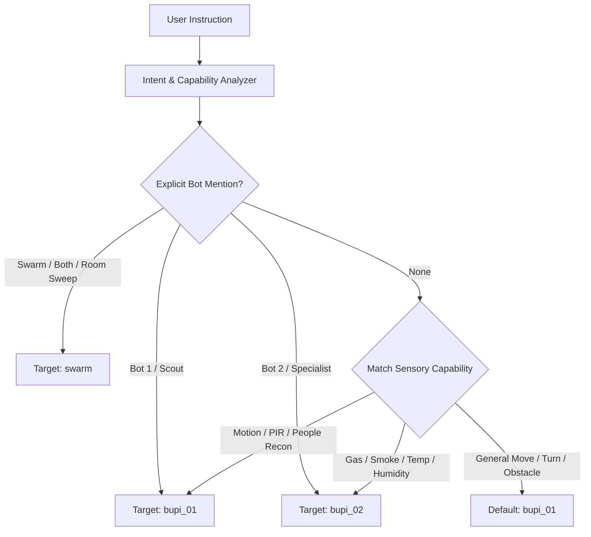

# BUPI Autonomous Robotics Skill & Knowledge Base

Use this skill when developing, debugging, running, or interacting with the **BUPI Mobile Robot Fleet**.

---

## 1. Multi-Robot Fleet Architecture & Pinout Specifications

BUPI operates a coordinated multi-robot disaster scouting and environmental inspection fleet using ESP32 Dev Modules running non-blocking 20Hz firmware.

### A. Shared Mobile Base: TB6612FNG Dual H-Bridge & Dual N20 Gear Motors
Supports two switchable hardware configurations via `#define PINOUT_CANONICAL 1` in firmware:

| Function | Canonical Pinout A (Recommended) | Legacy Breadboard Pinout B | Notes |
|---|---|---|---|
| **PWMA (Left Motor Speed)** | `GPIO 25` | `GPIO 25` | 100% full battery voltage / PWM (0–255) |
| **AIN1 (Left Motor Dir 1)** | `GPIO 26` | `GPIO 26` | Logic Output |
| **AIN2 (Left Motor Dir 2)** | `GPIO 27` | `GPIO 27` | Logic Output |
| **PWMB (Right Motor Speed)** | `GPIO 14` | `GPIO 33` | 100% full battery voltage / PWM (0–255) |
| **BIN1 (Right Motor Dir 1)** | `GPIO 33` | `GPIO 14` | Logic Output |
| **BIN2 (Right Motor Dir 2)** | `GPIO 32` | `GPIO 12` | Logic Output (Caution: GPIO 12 is strapping pin at boot) |
| **STBY (TB6612 Standby)** | `GPIO 4` | `GPIO 13` | Driven `HIGH` to enable motor driver outputs |

#### Motor Control Truth Table:
- **Forward**: `AIN1=HIGH, AIN2=LOW`, `BIN1=HIGH, BIN2=LOW`
- **Reverse**: `AIN1=LOW, AIN2=HIGH`, `BIN1=LOW, BIN2=HIGH`
- **Pivot Left**: `AIN1=LOW, AIN2=HIGH` (reverse left), `BIN1=HIGH, BIN2=LOW` (forward right)
- **Pivot Right**: `AIN1=HIGH, AIN2=LOW` (forward left), `BIN1=LOW, BIN2=HIGH` (reverse right)
- **Stop**: `AIN1=LOW, AIN2=LOW`, `BIN1=LOW, BIN2=LOW`, PWMs=0

---

### B. Robot Role Specializations & Hardware Assignment

#### 1. BUPI-01: Scout & Target Recon Bot
- **Robot ID**: `bupi_01` (Alias: `bot1`, `scout`)
- **Primary Capabilities**: Target Reconnaissance, PIR Thermal Motion Tracking, Ultrasonic Spatial Mapping, Closed-Loop IMU Heading Maneuvers.
- **Hardware Peripherals**:
  - **HC-SR04 Ultrasonic**: `TRIG = GPIO 5`, `ECHO = GPIO 18` (5V-to-3.3V voltage divider).
  - **PIR Motion Sensor**: `OUT = GPIO 19` (Digital input, active HIGH; GPIO 34 fallback supported).
  - **MPU-6050 6-Axis IMU**: `SDA = GPIO 21`, `SCL = GPIO 22` (I2C `0x68`). Real-time yaw heading and pitch/roll tilt.
- **MQTT Actuator Topics**:
  - `bupi/actuators/motors/cmd/json` (Primary)
  - `bupi/v1/bot1/actuators/motors/cmd/json` (Dedicated)
- **Firmware Sketch**: `firmware/bupi_bot1_scout/bupi_bot1_scout.ino`

#### 2. BUPI-02: Environmental & Hazard Specialist Bot
- **Robot ID**: `bupi_02` (Alias: `bot2`, `specialist`)
- **Primary Capabilities**: Gas Leak Detection (MQ-2), Air Quality & Smoke Indexing, Room Climate Monitoring (DHT22), Hazard Boundary Survey.
- **Hardware Peripherals**:
  - **TB6612FNG Driver**: `PWMA = 25`, `AIN1 = 26`, `AIN2 = 27`, `PWMB = 14`, `BIN1 = 12`, `BIN2 = 13`, `STBY = 33`
  - **HC-SR04 Ultrasonic**: `TRIG = GPIO 5`, `ECHO = GPIO 18` (5V-to-3.3V divider).
  - **MQ-2 Gas / Smoke Sensor**: `A0 = GPIO 34` (ESP32 ADC1_CH6, analog input; calibrated 0–1000 ppm scale).
  - **DHT22 Climate Sensor**: `DATA = GPIO 4` (Temperature -40 to 80°C, Relative Humidity 0–100%, 2s non-blocking timer).
  - **MPU-6050 6-Axis IMU**: `SDA = GPIO 21`, `SCL = GPIO 22` (I2C `0x68`).
- **MQTT Actuator Topics**:
  - `bupi/v1/bot2/actuators/motors/cmd/json`
  - `bupi/v1/bot2/actuators/motors/cmd`
- **Firmware Sketch**: `firmware/bupi_bot2_specialist/bupi_bot2_specialist.ino`

#### 3. Swarm Coordination: Multi-Agent Parallel Execution
- **Target ID**: `swarm` or `all`
- **Capabilities**: Parallel mission execution across both robots (e.g., Bot 1 performs a 360° circular sweep while Bot 2 conducts a linear forward traverse for gas profiling).
- **Coordinator**: `core/swarm_coordinator.py` maintains live multi-robot state synchronization.

---

## 2. Realistic Physical Sensor Calibrations & Physics Compensation

Never pass raw, uncompensated ADC readings directly to operators or LLMs. Always apply physical sensor compensation:

### A. MPU-6050 Silicon Die Self-Heating Offset (~18.5°C)
- **Physics**: The internal temperature register of the MPU-6050 measures the silicon junction temperature of the gyroscope/accelerometer die, which self-heats during operation to 40°C–45°C even in a 24°C room.
- **Compensation Rules**:
  1. When **DHT22** is present (Bot 2), **always prioritize DHT22** as the authoritative ambient room temperature source.
  2. If only the MPU-6050 temperature is available, apply the calibrated self-heating compensation:
     $$T_{\text{ambient}} = T_{\text{MPU}} - 18.5^\circ\text{C}$$
  3. If uncompensated or disconnected ($T \le 0$ or $T > 50^\circ\text{C}$), fallback to nominal ambient baseline ($24.5^\circ\text{C}$).

### B. MQ-2 Gas & Smoke Piecewise Calibration Curve
- **Physics**: In clean ambient air, the MQ-2 sensor's internal heater produces an analog voltage corresponding to ADC 200–450. Naive linear mappings falsely flag this clean air as 350–420 ppm (false hazard).
- **Calibrated Piecewise Mapping**:
  | Raw ADC (12-bit) | Voltage (V) | Calibrated PPM | Air Quality Interpretation | Semantic Action |
  |---|---|---|---|---|
  | **0 – 400** | 0.0 – 0.97V | **20 – 50 ppm** | Fresh, clean ambient air | Safe (CRUISE allowed) |
  | **401 – 1200** | 0.97 – 2.9V | **50 – 150 ppm** | Normal indoor baseline, trace VOCs | Safe / Nominal |
  | **1201 – 2500** | 2.9 – 3.2V | **150 – 300 ppm** | Elevated gas/smoke plume detected | Warning / Alert operator |
  | **> 2500** | > 3.2V | **300 – 1000 ppm** | Critical combustion / flammable hazard | Danger (Halt & Evacuate) |

### C. HC-SR04 Acoustic Echo Timeout Translation
- **Physics**: When the ultrasonic pulse encounters no obstacle within its 4-meter cone, the echo pulse times out (~25ms), returning 400.0 cm (or 0.0 cm).
- **Conversational Translation**:
  - Do NOT announce: *"The distance is 400 centimeters."*
  - State: *"Forward corridor is wide open with clear clearance ahead (over 2.5 meters)."*
  - When $d \le 15\text{ cm}$: *"Critical obstacle detected within 15 cm; forward movement prohibited."*
  - When $15 < d \le 50\text{ cm}$: *"Obstacle in immediate path at [X] cm; recommend detour."*

### D. PIR Thermal Flux Epistemic Honesty
- **Physics**: Passive Infrared sensors detect changes in differential infrared radiation (thermal flux); they have no optics to resolve spatial forms or identify human identity.
- **Rules**:
  1. `PIR == 1` alone: Report `POSSIBLE_WARM_MOVING_TARGET` or `THERMAL_FLUX_DETECTED`. Never report *"Human confirmed"*.
  2. Fusion (`PIR == 1` AND $20\text{ cm} \le d \le 250\text{ cm}$): Report `POSSIBLE_HUMAN_PRESENCE` with estimated distance and bearing.

---

## 3. Dynamic Zero-Hardcoding Routing Engine

BUPI's planning and execution architecture strictly prohibits hardcoding instructions. Instead, it uses a hierarchical capability-matching engine:

### Hierarchy Rules:
1. **Explicit Target Override**: Mention of "Bot 1", "Scout", "Bot 2", "Specialist", "Swarm", or "Both" unconditionally sets `robot_id`.
2. **Capability-Driven Auto-Routing**:
   - Queries or tasks involving gas, smoke, PPM, temperature, humidity, climate &rarr; Route to **Bot 2 (`bupi_02`)**.
   - Queries or tasks involving motion, infrared, PIR, human search, patrol &rarr; Route to **Bot 1 (`bupi_01`)**.
3. **Multi-Robot Cooperative Dispatch**:
   - Instructions involving room-wide scans or cooperative search dispatch simultaneous sub-plans to both robots.
4. **Locomotion Fallback**:
   - Single-agent directional movements (e.g. "move forward 2 seconds", "turn right 90 degrees") default to **Bot 1 (`bupi_01`)** without multi-robot contention.

---

## 4. Parameterized Dynamic Mission Policies

The `InstructionDecomposer` transforms natural language into executable policy parameters:

1. **`CONDITIONAL_MOVE`**:
   - Drives robot forward/reverse until sensor condition is met (e.g., *"drive forward until obstacle within 25 cm"*).
2. **`SCAN_SWEEP`**:
   - Executes 360° rotational scan, sampling sensor readings at 45° or 60° increments to locate targets or map clearance.
3. **`ENVIRONMENTAL_PROBE`**:
   - Queries Bot 2 for live gas PPM, temperature, and humidity, applying piecewise calibration and generating a spoken TTS summary.
4. **`SWARM_RECON`**:
   - Decomposes into dual parallel tasks: Bot 1 executes a 360° perimeter scan while Bot 2 advances forward sampling environmental safety.
5. **`MONITOR_HOLD`**:
   - Enters low-power sentry state, alerting on PIR motion or gas threshold breach.
6. **`ROTATE_TO`**:
   - Closed-loop angular turn using MPU-6050 IMU gyro feedback.
7. **`EXPLORE_SAFE`**:
   - Continuous wandering with proactive reactive evasion.

---

## 5. Hardware Fail-Safe Safety Supervisor

The safety layer runs as an unconditional hardware gatekeeper:
- **Emergency Barrier Cutoff**: Distance $\le 10.0\text{ cm}$ unconditionally cuts all motor power.
- **Warning Corridor ($10\text{ cm} < d \le 25\text{ cm}$)**: Forward drive is blocked; reverse and rotational evasion maneuvers are permitted.
- **Rollover Tilt Protection**: Pitch $> 35^\circ$ or Roll $> 35^\circ$ immediately halts drive to prevent robot rollover.
- **Gas Plume Boundary**: Gas $\ge 300\text{ ppm}$ blocks forward driving toward the source, forcing evasive retreat.
- **Watchdog Timeout**: Motor commands automatically expire after 2000ms if no keep-alive packet is received.

---

## 6. MQTT Topics & Telemetry Matrix

| Purpose | Bot 1 (Scout) | Bot 2 (Specialist) | Swarm Broadcast |
|---|---|---|---|
| **Motor Drive (JSON)** | `bupi/actuators/motors/cmd/json` | `bupi/v1/bot2/actuators/motors/cmd/json` | `bupi/actuators/motors/cmd/json` |
| **Ultrasonic Distance** | `bupi/sensors/distance/state` | `bupi/bupi_02/sensors/distance/state` | — |
| **PIR Motion** | `bupi/sensors/pir/state` | — | — |
| **Gas / Smoke (MQ-2)** | — | `bupi/sensors/mq2/state` | — |
| **Temperature** | `bupi/sensors/mpu/temp` | `bupi/sensors/dht/temperature` | — |
| **Humidity** | — | `bupi/sensors/dht/humidity` | — |
| **IMU / Kinematics** | `bupi/sensors/imu/state` | `bupi/bupi_02/sensors/imu/state` | — |
| **Node Heartbeat** | `bupi/nodes/heartbeat` | `bupi/nodes/heartbeat` | — |
