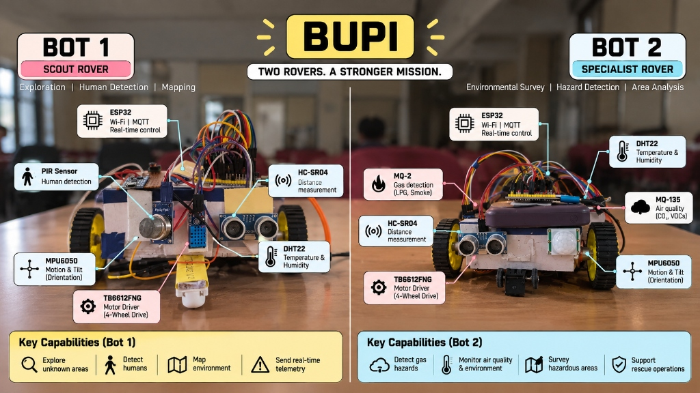

# BUPI COMPLETE GROUND-TRUTH SYSTEM DATASET
## Pure Reference & Prompting Data for ChatGPT / AI Tools (Problem Statement 26201)

> **Dataset Purpose**: Copy-pasteable factual repository data for generating PPT slides, architecture diagrams, academic papers, and technical proposals.  
> **Source Ground Truth**: Verified directly from code in `c:\Users\Sachin\boopi\assistant`. Zero marketing fluff, zero hallucinations.

---

## 1. SYSTEM IDENTITY & CORE SPECS
- **Project Name**: BUPI (Brain-Unified Personal Intelligence & Robotic Controller)
- **Problem Statement**: SIH Problem Statement 26201 (Autonomous Edge Robotics & Intelligent Companion)
- **Architecture Philosophy**: Dual-personality (Desktop Companion + Autonomous Robotics), Local-First, Edge-Connected, Fail-Safe.
- **Operating Modes**:
  - **Mode 1 (Desktop Companion)**: Natural conversation, task tracking, voice assistant. Uses Electron UI, Faster-Whisper, Edge-TTS, and Google Gemini / OpenRouter.
  - **Mode 2 (Autonomous Robotics Controller)**: Local-first 3-tier decision engine controlling dual physical ESP32 differential-drive rovers (Bot 1 Scout, Bot 2 Specialist) and Bit-World Engine (BWE) digital twin simulator.
- **Operating System**: Windows 11 (Host Controller)
- **Primary Subnet**: `192.168.137.0/24` (Windows Mobile Hotspot, Host Gateway: `192.168.137.1`)
- **Key Microcontrollers**: 2x ESP32 Dev Modules (Tensilica Xtensa 32-bit LX6 dual-core @ 240MHz)

---

## 2. RUNTIME, PROCESSES, THREADS & PORTS

### Process Hierarchy
1. `Run_Bupi_Robot.bat` (Master launcher batch script)
2. `mosquitto.exe` (Local MQTT Broker, Port `127.0.0.1:1883`)
3. `ollama.exe serve` (Local LLM Inference Server, Port `127.0.0.1:11434`)
4. `powershell.exe ensure_hotspot.ps1` (Ensures Wi-Fi Hotspot on `192.168.137.1`)
5. `electron.exe main.js --mode 2` (Desktop GUI runtime, Electron 41.2.1 / Chromium)
6. `python.exe main.py --mode 2` (Mode 1 Supervisor, spawns background services)
7. `python.exe run_mode2.py` (Mode 2 Dedicated Robotics Decision Daemon)

### Thread Map (Inside `main.py`)
- `MainThread`: Headless `QCoreApplication(sys.argv)` event loop (Zero GUI widgets; purely for Qt signals/threads).
- `ListenerThread`: 16kHz audio capture via `sounddevice`, WebRTC VAD (360ms window), Faster-Whisper (`tiny.en`) transcription.
- `SpeakerThread`: Consumes speech queue; plays Microsoft Edge-TTS neural audio (with offline SAPI5 `pyttsx3` fallback).
- `AIThread`: Mode 1 conversational streaming with Google Gemini / OpenRouter.
- `ActivityMonitorService`: Background thread polling Windows idle time and active window titles.
- `WebSocketServer Thread`: Asyncio event loop hosting WebSocket server on `0.0.0.0:8767`.
- `SerialSupervisor Thread`: Manages auto-reconnect and reads USB UART on `COM3` at 115200 baud.
- `DbWriter Thread`: Flushes queued sensor readings to SQLite `bupi_telemetry.db` every 1.5 seconds.
- `HotspotWatchdog Thread`: Polls Windows hotspot state every 30 seconds.
- `StdinReader Thread`: Listens for JSON commands from Electron on standard input.

### Network Ports & Communication Fabric
- `127.0.0.1:1883` (TCP): Mosquitto MQTT Broker.
  - Topics: `bupi/internal/utterance` (Mode 1 -> Mode 2), `bupi/internal/tts` (Mode 2 -> Mode 1), `bupi/internal/estop` (Emergency Stop broadcast), `bupi/actuators/motors/cmd/json` (Motor commands).
- `0.0.0.0:8767` (TCP / WebSocket): `bupi_node_server.py`. Handles node announcements, 20Hz telemetry frames, and UI state sync.
  - *Note*: Port `8765` was a typo in legacy documentation; the active code binds strictly to `8767`.
- `COM3` (USB Serial UART): 115200 baud wired backup connection for ESP32.
- `127.0.0.1:11434` (HTTP): Ollama local REST API (`/v1/chat/completions`).

---

## 3. UI ARCHITECTURE
- **Desktop UI Technology**: **100% Electron (Chromium / Node.js)**.
- **Window 1 (Mascot)**: `index.html` (250x250 frameless, transparent, always-on-top overlay). Features 3D GLTF mascot model (`cute_character.glb` rendered with Three.js) or Rive animation (`tiny_mascot.riv`).
- **Window 2 (Central Control Hub)**: `notepad.html` (1200x800 desktop cockpit with 11 functional tabs):
  1. Notes & Ideas panel
  2. BUPI Autonomous panel (goal inputs, patrol triggers)
  3. Missions & Reports (historical records from SQLite)
  4. Hardware Setup / Ingest (Arduino C++ code paste area & auto-flash)
  5. ESP32 Manual Control (D-pad & manual relay switches)
  6. Active Lab / Trained Agents (view dynamically spawned hardware agents)
  7. Chat History (conversational logs from SQLite)
  8. 2D Tactical Arena Canvas (`spatial_twin_2d.html` iframe)
  9. Settings & Token Tracker (API key rotation status for Gemini, Groq, NVIDIA, OpenRouter)
  10. System Diagnostics & Activity Monitor
  11. Mode Switcher (Pill toggle between Mode 1 Companion and Mode 2 Robot)

---

## 4. 3-TIER DECISION PIPELINE (LATENCY & LOGIC)

| Tier | Module & Entry Point | Technology / Model | Latency | Scope & Behavior | Escalation Trigger |
| :--- | :--- | :--- | :---: | :--- | :--- |
| **Tier 1** | `agents/router_agent.py`<br/>`quick_regex_classify()` | Deterministic Python Regex (`re`) | **< 5 ms** | Emergency stop (`stop`, `halt`, `freeze`), basic movements (`forward`, `backward`, `turn`), sensor status queries. Zero AI hallucination. | Returns `None` if command does not match fast-pass patterns. |
| **Tier 2** | `agents/local_orchestrator.py`<br/>`run_task()` | Local Ollama (`llama3.2:3b` with fallback to `llama3.1:8b`) | **~500 ms** | Single-turn tool calling using 12 OpenAI-compatible function schemas. 100% offline edge execution for room scans, gas checks, and mission starts. | Escalates to Tier 3 if Ollama server is offline, throws an exception, or fails schema validation. |
| **Tier 3** | `agents/robotic_crew.py`<br/>`run_robotic_task()` | Hierarchical CrewAI Multi-Agent System | **5–15 s** | Multi-agent mission decomposition (Scout Analyst, Specialist, Coordinator). Executes sequential model fallback chain. | Falls back through: `ollama/llama3.2:3b` $\rightarrow$ `ollama/llama3.1:8b` $\rightarrow$ `gemini-2.5-flash` $\rightarrow$ `groq/llama-3.3-70b-versatile` $\rightarrow$ `nvidia/deepseek-v4-pro` $\rightarrow$ `openrouter/meta-llama-3.3-70b:free`. |

---

## 5. HARDWARE SPECIALIZATION & SENSOR PAYLOADS



### Bot 1: Reconnaissance Scout (`bupi_01`)
- **Firmware**: `firmware/bupi_bot1_scout.ino`
- **Microcontroller**: ESP32 Dev Module
- **Actuation**: TB6612FNG Dual H-Bridge driving 2x N20 Micro Metal Gearmotors
- **Sensor Payload**:
  - HC-SR04 Ultrasonic Sensor (Trigger: GPIO 5, Echo: GPIO 18)
  - MPU6050 6-Axis IMU (I2C SDA: GPIO 21, SCL: GPIO 22, Address: `0x68`)
  - PIR Pyroelectric Infrared Motion Sensor (GPIO 34 / 19)
- **Telemetry Frequency**: 20Hz (50ms period) over WebSocket (`ws://192.168.137.1:8767`)
- **Sensors NOT Present**: MQ-2 Gas sensor and DHT22 climate sensor are NOT read on Bot 1.

### Bot 2: Environmental Specialist (`bupi_02`)
- **Firmware**: `firmware/bupi_bot2_specialist.ino`
- **Microcontroller**: ESP32 Dev Module
- **Actuation**: TB6612FNG Dual H-Bridge driving 2x N20 Micro Metal Gearmotors
- **Sensor Payload**:
  - HC-SR04 Ultrasonic Sensor (Trigger: GPIO 5, Echo: GPIO 18)
  - MPU6050 6-Axis IMU (I2C SDA: GPIO 21, SCL: GPIO 22, Address: `0x68`)
  - MQ-2 Toxic Gas Sensor (Analog Pin: GPIO 34, ADC1_CH6)
  - DHT22 Temperature & Humidity Sensor (Data Pin: GPIO 4, 2000ms sample interval)
- **Telemetry Frequency**: 20Hz over WebSocket
- **Sensors NOT Present**: PIR Motion Sensor is NOT read on Bot 2.

### Auxiliary Display Node (`esp32_hive_display`)
- **Firmware**: `esp32_hive_display.ino`
- **Hardware**: ESP32 Dev Module + 1602 LCD with PCF8574 I2C Backpack (`0x27`)
- **Role**: Subscribes to MQTT topics to display system mode, battery, and gas alerts on an operator desk.

---

## 6. AUTONOMY & CLOSED-LOOP CONTROL

### 20Hz Autonomous Goal Loop (`agents/autonomous_goal_agent.py:152`)
- **Thread Rate**: Dedicated background thread executing at 20Hz (50ms cycle).
- **Cycle Breakdown**:
  1. **OBSERVE (5ms)**: Queries `bupi_node_server.get_latest_telemetry()`. Fetches ultrasonic distance, MPU6050 accelerations/gyros, PIR state, and MQ-2 gas PPM. Updates kinematics odometry state.
  2. **REASON (10ms)**: Compares current state against active policy. Checks stop conditions (distance met, survivor acquired, gas threshold exceeded, timeout). Checks collision boundaries.
  3. **ACT (5ms)**: Calculates motor speeds and publishes JSON command to `bupi/actuators/motors/cmd/json`. Broadcasts updated coordinates to Electron 2D arena canvas.
  4. **SLEEP (30ms)**: Maintains strictly bounded 20Hz loop rate.

### 11 Implemented Mission Policies
1. `EXPLORE_AND_MAP`: Autonomous corridor exploration with sonar bounds.
2. `PATROL_PERIMETER`: Boundary surveillance traversal.
3. `SURVIVOR_SEARCH`: Heat/motion detection using PIR and forward crawling.
4. `GAS_LEAK_INVESTIGATION`: Concentration gradient tracking toward gas plume source.
5. `TARGET_APPROACH`: Vector approach toward target coordinates.
6. `RETURN_TO_ORIGIN`: Inverse vector traversal back to `(0, 0)`.
7. `OBSTACLE_AVOIDANCE_STAGE`: Intercept stage for obstacle flank.
8. `COLLABORATIVE_SWARM_SWEEP`: Tandem scout + specialist sweep.
9. `SYSTEM_HEALTH_CHECK`: Actuator and sensor verification spin.
10. `STATIONARY_MONITOR`: Sentry mode with alert triggers.
11. `CUSTOM_DECOMPOSED_POLICY`: Dynamically generated by `instruction_decomposer.py`.

### Reactive 5-Stage Obstacle Detour Engine (`core/obstacle_bypass_engine.py:40`)
- **Trigger**: Ultrasonic distance $\le 15.0\text{ cm}$ during an active mission.
- **Stage 1 (REVERSE)**: Back off 15cm from obstacle.
- **Stage 2 (PIVOT)**: Rotate right 60° to clear obstacle profile.
- **Stage 3 (ADVANCE)**: Move forward 30cm along lateral flank.
- **Stage 4 (COUNTER-PIVOT)**: Rotate left -60° to restore original mission heading.
- **Stage 5 (RESUME)**: Continue forward along original mission trajectory.
- **Execution**: Pure deterministic state machine; zero LLM calls during detour.

---

## 7. ODOMETRY & SENSOR FUSION REALITY
- **Kalman Filter / EKF Status**: **NOT FOUND** in repository code (was an unverified claim in past presentation drafts).
- **Actual Verified Engine**: **Epistemic Kinematics Fusion Engine** (`core/kinematics_odometry.py:L1-L253`):
  - **IMU Dynamic Gait Step Detection**:
    - Calculates total acceleration: $a_{\text{total}} = \sqrt{a_x^2 + a_y^2 + a_z^2}$.
    - Registers step when $a_{\text{total}} \ge 1.20\text{g}$.
    - Debounce filter: 180ms refractory period between steps.
    - Stride length: 0.075 m (7.5 cm) per step.
  - **Gyro Yaw Dead-Reckoning**:
    - Continuously integrates MPU6050 Z-gyro angular velocity: $\theta = \theta + (g_z \times dt)$.
    - Position update: $x = x + \Delta d \cos(\theta)$, $y = y + \Delta d \sin(\theta)$.
  - **Wi-Fi RSSI Log-Distance Path Loss**:
    - Distance formula: $d = 10^{\frac{-42.0 - \text{RSSI}}{25.0}}$.
    - Smoothed via Exponential Weighted Moving Average (EWMA) with $\alpha = 0.25$.
    - Bounds unbounded cumulative dead-reckoning drift.

---

## 8. MULTI-LAYER SAFETY ARCHITECTURE

| Safety Layer | Implementation Location | Threshold / Trigger | Action Taken | LLM Override Possible? |
| :--- | :--- | :--- | :--- | :---: |
| **Layer 1: Deterministic E-Stop** | `agents/router_agent.py:80` | Regex: `stop`, `halt`, `freeze` | Instant motor halt (`left=0, right=0`) | **NO** (Bypasses all LLMs) |
| **Layer 2: Telemetry TTL Watchdog** | `core/safety_validator.py:6` | Telemetry age $> 15.0\text{ seconds}$ | Rejects new movement commands (`approved: False`) | **NO** |
| **Layer 3: Gas Hazard Barrier** | `core/safety_validator.py:125` | MQ-2 Gas $> 300\text{ ppm}$ | Rejects forward driving; blocks ventilation shutoff | **NO** |
| **Layer 4: Swarm Evacuation Interlock**| `core/swarm_coordinator.py:131` | MQ-2 Gas $> 350\text{ ppm}$ | Broadcasts emergency stop to BOTH Bot 1 and Bot 2 | **NO** |
| **Layer 5: Node Heartbeat Guard** | `bupi_node_server.py:184` | Silence $> 15.0\text{ seconds}$ | Marks node state as `OFFLINE` in registry | **NO** |
| **Layer 6: Firmware Motor Auto-Stop** | `firmware/bupi_bot1_scout.ino:676`| Command `duration_ms` elapsed | Microcontroller cuts PWM locally | **NO** (Firmware reflex) |
| **Dev Mode Disclosure** | `bupi_bot1_scout.ino:85` | `#define ENABLE_OBSTACLE_CUTOFF 0` | Firmware obstacle cutoff disabled in dev to allow bench tests | Easily enabled by setting to `1` |

---

## 9. DYNAMIC C++ HARDWARE INGESTION & RAG ENGINE
- **Purpose**: Allows teaching BUPI arbitrary new physical sensors, actuators, and displays without modifying Python core code.
- **Workflow**:
  1. **User Input**: Engineer pastes raw Arduino C++ snippet for a new peripheral into Central Hub (`notepad.html`).
  2. **FTS5 Knowledge Query**: `services/knowledge_super_agent.py` executes a sub-millisecond full-text search against `brain/fts5_hardware_index.db` to retrieve verified pinout rules, I2C addresses, and library dependencies.
  3. **Sketch Synthesis**: `brain/ai_brain.py:process_hardware()` wraps the user snippet with Wi-Fi connection logic, MQTT topic subscribers, and JSON telemetry publishers.
  4. **Command Memory Persistence**: Appends the device's exact MQTT command signature to `hardware_memory.txt` (e.g., `- Tilt Servo: To set angle to X, send [MQTT_SEND:bupi/actuators/servo_1/cmd:X]`).
  5. **Auto-Flashing**: `actions/flasher.py:auto_flash_code()` compiles the sketch using the local `arduino-cli` binary and flashes the compiled binary over the auto-detected USB COM port.
  6. **Instant LLM Control**: Both Tier 2 (Ollama) and Tier 3 (CrewAI) inject `hardware_memory.txt` into their system prompts and invoke `actions/hardware_tools.py:universal_mqtt_tool(topic, payload)` to command the new device immediately.

---

## 10. CANONICAL JSON SCHEMAS & PACKETS

### Node Announcement Packet (WebSocket / MQTT)
```json
{
  "type": "announce",
  "client_id": "bupi_01",
  "role": "scout",
  "device_type": "ESP32_WROOM_32D",
  "capabilities": ["Motors", "Ultrasonic", "IMU", "PIR_Motion"],
  "sensors": { "ultrasonic": true, "imu": true, "pir": true, "gas": false, "climate": false },
  "actuators": { "differential_motors": true, "servo": false, "relay": false, "display": false },
  "ip_address": "192.168.137.101",
  "firmware_version": "bupi_scout_v2.4.1"
}
```

### 20Hz Telemetry Packet (WebSocket `:8767`)
```json
{
  "node_id": "bupi_01",
  "timestamp": 1727625600.125,
  "ultrasonic": { "distance_cm": 42.5 },
  "imu": { "ax": 0.02, "ay": -0.01, "az": 1.01, "gx": 0.1, "gy": -0.2, "gz": 0.0, "tilt_deg": 1.2 },
  "environmental": { "mq2_gas_raw": 180, "mq2_gas_ppm": 24.5, "temperature_c": 26.8, "humidity_pct": 55.2, "pir_motion_detected": false },
  "network": { "rssi_dbm": -48, "wifi_connected": true },
  "odometry": { "total_steps": 142, "x_pos_m": 3.25, "y_pos_m": 1.80, "yaw_deg": 45.0 }
}
```

### Motor Command Packet (`bupi/actuators/motors/cmd/json`)
```json
{
  "action": "forward",
  "left_speed": 180,
  "right_speed": 180,
  "duration_ms": 1000,
  "target_robot": "bupi_01"
}
```

---

## 11. BIT-WORLD ENGINE (BWE) DIGITAL TWIN SIMULATOR
- **Core Engine**: Implemented in JavaScript inside `bwe/core/engine.js` and `bwe/core/physics.js`.
- **Virtual Peripherals**: Modeled in `bwe/peripherals/` (GPIO states, PWM duty cycle 0–255, 12-bit ADC 0–4095, I2C/SPI buses).
- **Plugins**: HC-SR04 ultrasonic raycasting (`hcsr04.js`), MQ-2 gas diffusion plume model (`mq2.js`), servo motors (`servo.js`), SSD1306 OLED displays (`oled.js`).
- **Hardware-in-the-Loop (HIL)**: `bwe/interface/hil_bridge.js` allows physical ESP32 boards flashing `esp32_bwe_mqtt_client.ino` to connect to simulated environment peripherals over USB Serial.
- **Parity**: Emulates ESP32 JSON telemetry format identically; `AutonomousGoalAgent` runs unaltered against simulated rovers.

---

## 12. EXTENSIBILITY TEST MATRIX (4 HYPOTHETICAL DEVICES)

| Device | Declared Capabilities | Protocol | Python Core Changes? | How It Integrates |
| :--- | :--- | :--- | :---: | :--- |
| **A: ESP32 + Servo Tilt-Pan + Sonar** | `["Servo_Pan", "Ultrasonic_Sweep"]` | MQTT (`bupi/actuators/sonar_turret/cmd`) | **ZERO (0) LINES** | User pastes C++ $\rightarrow$ auto-flashed $\rightarrow$ rule saved in `hardware_memory.txt` $\rightarrow$ LLM calls `universal_mqtt_tool`. |
| **B: ESP32-CAM (OV2640)** | `["Camera_Stream", "Snapshot"]` | HTTP MJPEG (`http://192.168.137.x:81/stream`) | **~15 lines** (UI / tools) | Add `` viewport in `notepad.html`; add `capture_camera_snapshot()` tool in `hardware_tools.py`. |
| **C: ESP32 Flying Drone (UAV)** | `["Flight_Control", "Altitude_Hold"]` | MQTT / MAVLink Serial | **Mandatory** (Kinematics) | Reuses 3-tier routing and safety; requires extending odometry from 2D planar to 3D space $(x, y, z)$. |
| **D: Raspberry Pi 5 Tracked Crawler** | `["Motors", "Crawler", "Gas_Array"]` | MQTT (`bupi/actuators/motors/cmd/json`) | **ZERO (0) LINES** | Accepts standard differential motor command schema. Runs lightweight Python MQTT listener on RPi GPIO. |

---

## 13. GROUND-TRUTH ARCHITECTURE TRUTH TABLE

| Subsystem | Status Tag | Verified Reality | Evidence Reference |
| :--- | :---: | :--- | :--- |
| **Voice STT** | `[VERIFIED IN CODE]` | Faster-Whisper (`tiny.en`), WebRTC VAD | `voice/listener.py:82` |
| **Voice TTS** | `[VERIFIED IN CODE]` | Microsoft Edge-TTS with SAPI5 pyttsx3 fallback | `voice/speaker.py:31` |
| **Tier 1 Fast Regex** | `[VERIFIED IN CODE]` | <5ms deterministic emergency stop & moves | `agents/router_agent.py:80` |
| **Tier 2 Local Ollama** | `[VERIFIED IN CODE]` | ~500ms single-turn tool calling (llama3.2:3b) | `agents/local_orchestrator.py:230` |
| **Tier 3 CrewAI** | `[VERIFIED IN CODE]` | 5-15s hierarchical fallback (Local -> Cloud) | `agents/robotic_crew.py:123` |
| **Autonomous Goal Agent**| `[VERIFIED IN CODE]` | 20Hz loop, 11 policies, decomposed plans | `agents/autonomous_goal_agent.py:152` |
| **Obstacle Detour Engine**| `[VERIFIED IN CODE]` | 5-stage geometric bypass (Reverse, Pivot, Advance) | `core/obstacle_bypass_engine.py:40` |
| **Dual-Rover Swarm** | `[VERIFIED IN CODE]` | Bot 1 Scout (PIR) & Bot 2 Specialist (Gas/Climate) | `firmware/bupi_bot1_scout.ino` |
| **Safety Interlocks** | `[VERIFIED IN CODE]` | 15s TTL watchdog, Gas cutoff >300ppm, auto-stop | `core/safety_validator.py:112` |
| **Dynamic Ingestion** | `[VERIFIED IN CODE]` | Arduino C++ RAG synthesis, FTS5 & auto-flasher | `brain/ai_brain.py:393` |
| **Odometry Engine** | `[VERIFIED IN CODE]` | 1.20g IMU step detection & Wi-Fi RSSI path loss | `core/kinematics_odometry.py:140` |
| **Desktop UI & Mascot** | `[VERIFIED IN CODE]` | 100% Electron Chromium (Mascot & 11-Tab Hub) | `notepad.html`, `main.js:57` |
| **BWE Digital Twin** | `[VERIFIED IN CODE]` | JavaScript simulation engine & physical HIL bridge | `bwe/core/engine.js` |
| **Extended Kalman (EKF)**| `[NOT FOUND]` | Replaced by epistemic kinematics step counter | Verified absent from repository |
| **Raspberry Pi Compute** | `[DOCUMENTED ONLY]` | Concept in pitch decks; zero Linux daemons exist | Requires `bupi_rpi_agent.py` |
| **Computer Vision / YOLO**| `[NOT FOUND]` | No OpenCV (`cv2`) or YOLO pipelines in backend | Viewport camera terms exist only in Three.js |
| **Aerial Drones (UAVs)** | `[FUTURE / ROADMAP]` | Concept in pitch decks; requires 3D flight control | Requires 3D kinematics extension |

---
*End of Prompting Dataset — Use this reference to prompt ChatGPT, Claude, Gamma, or presentation builders.*
