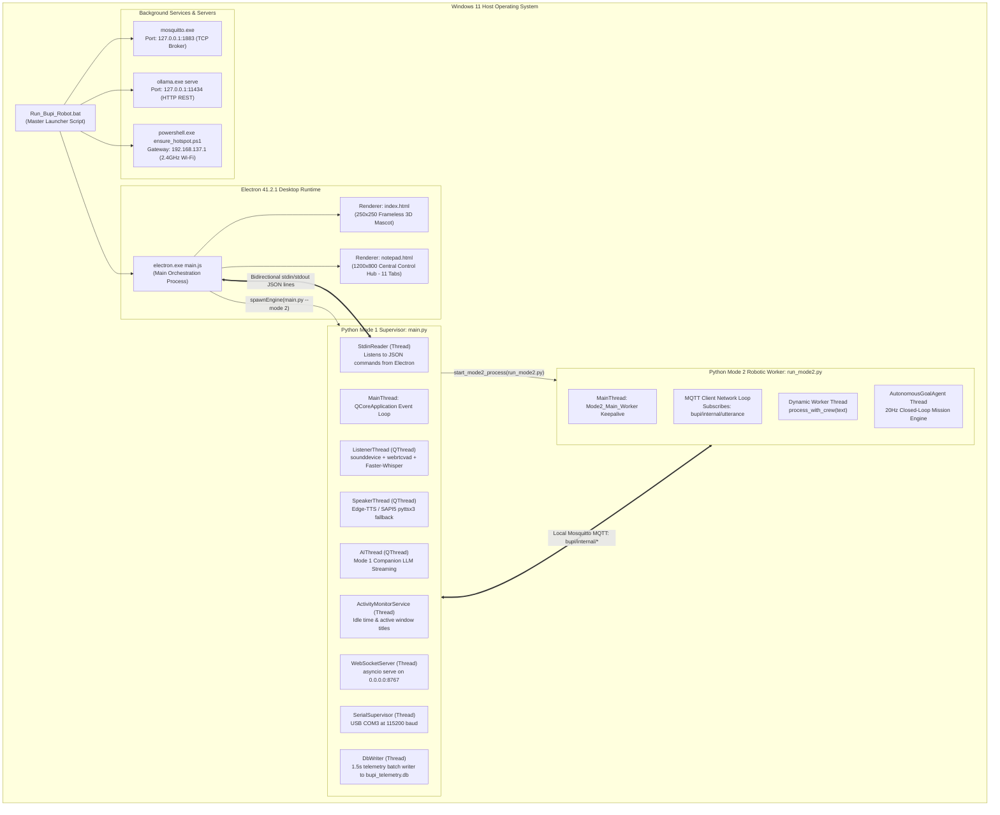
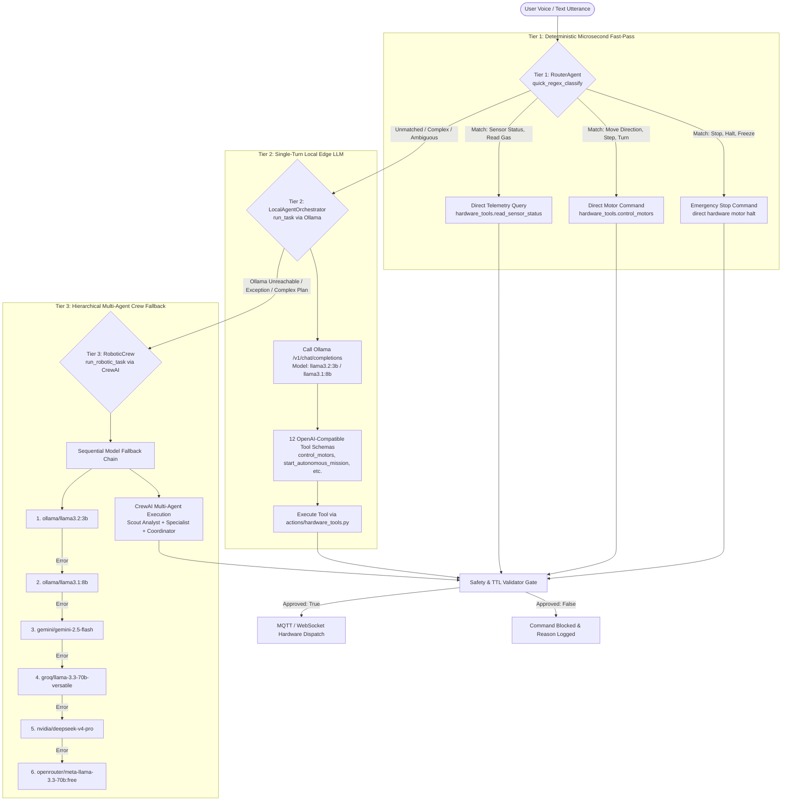
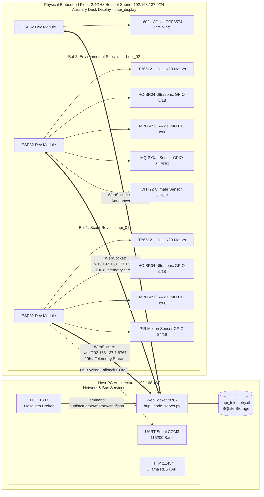
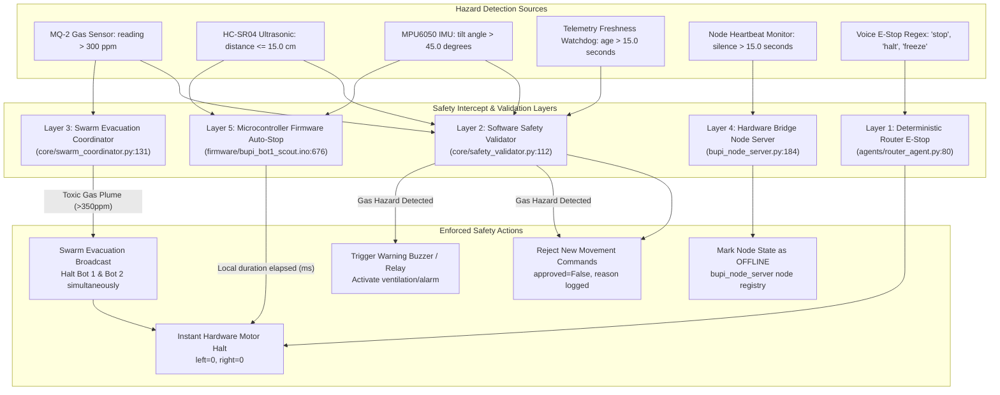
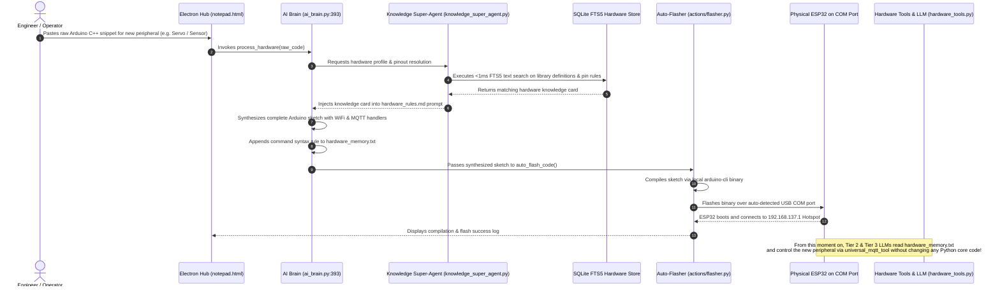
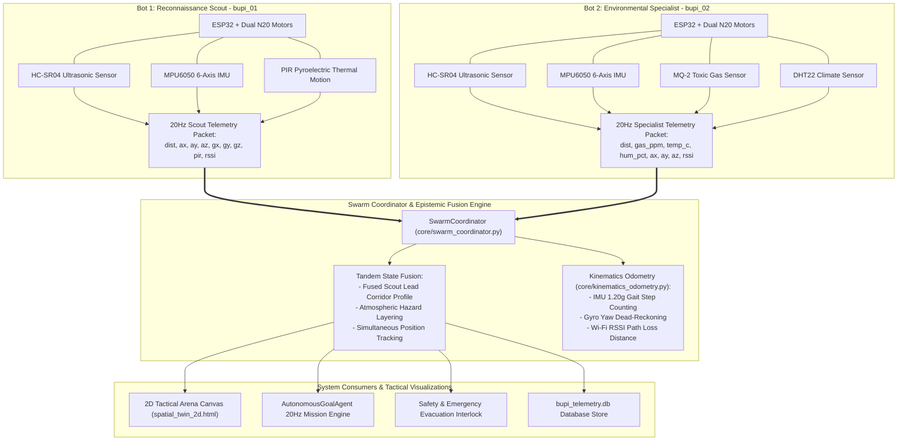

# BUPI MASTER SYSTEM ARCHITECTURE DIAGRAMS (PROBLEM STATEMENT 26201)
## Verified Architectural Diagrams & Process Models

> **Document Type**: Technical Architecture Diagram Specifications  
> **Source Ground Truth**: Verified against production code in `c:\Users\Sachin\boopi\assistant`  
> **Target Problem Statement**: SIH Problem Statement 26201

---

## 1. Production Process & Thread Tree Diagram



---

## 2. 3-Tier Intelligence & Decision Routing Architecture



---

## 3. Hardware Communication & Network Topology



---

## 4. 20Hz Closed-Loop Autonomy Cycle (Observe -> Reason -> Act)

```mermaid
stateDiagram-v2
    [*] --> Idle : System Ready

    Idle --> Decomposing : Voice Instruction Received ("Find human and check gas")
    Decomposing --> MissionLoop : DynamicMissionPlan Instantiated (instruction_decomposer.py:588)

    state MissionLoop {
        [*] --> Observe
        
        state "1. OBSERVE (5ms)" as Observe {
            FetchSensors: Query bupi_node_server.py latest telemetry
            ReadUltrasonic: HC-SR04 distance
            ReadIMU: MPU6050 6-axis acceleration and gyro
            ReadEnvironment: MQ-2 Gas PPM, DHT22 Temp/Humidity, PIR
            ComputeOdometry: kinematics_odometry.process_telemetry()
        }
        
        Observe --> Reason
        
        state "2. REASON (10ms)" as Reason {
            CheckStagePolicy: Match current active stage against 11 Policies
            CheckHazards: Gas > 300ppm or Obstacle < 15cm
            CheckStopCondition: Distance met, target acquired, or timeout
        }
        
        Reason --> BypassObstacle : Obstacle < 15cm detected
        Reason --> AbortHazard : Gas > 300ppm detected
        Reason --> StageComplete : Stop Condition Satisfied
        Reason --> Act : Path Clear & Moving
        
        state "3. ACT (5ms)" as Act {
            ComputeVector: Linear speed & heading bias
            PublishMotorCmd: MQTT bupi/actuators/motors/cmd/json
            StreamUIState: Broadcast mission progress to 2D Arena
        }
        
        Act --> Sleep50ms
        Sleep50ms --> Observe : 20Hz Frequency Maintained
    }

    state "Obstacle Bypass Engine" as BypassObstacle {
        Reverse15: Reverse 15cm
        Pivot60: Pivot Right 60 deg
        Advance30: Advance Flank 30cm
        CounterPivot: Counter-Pivot Left -60 deg
        Resume: Resume Path
        Reverse15 --> Pivot60 --> Advance30 --> CounterPivot --> Resume
    }
    
    BypassObstacle --> MissionLoop : Detour Completed
    
    StageComplete --> MissionLoop : Next Stage in DynamicMissionPlan
    StageComplete --> MissionFinished : All Stages Completed
    
    AbortHazard --> EmergencyHalt : Swarm Evacuation Broadcast
    EmergencyHalt --> [*] : Mission Aborted Safely
    MissionFinished --> [*] : Mission Succeeded & Debrief Saved
```

---

## 5. Multi-Layer Safety Interlock & Hazard Cascade



---

## 6. Dynamic C++ Hardware Ingestion & Self-Learning Pipeline



---

## 7. Heterogeneous Swarm Fusion & Sensor Specialization Architecture



---
*End of Architecture Diagram Specifications — SIH Problem Statement 26201*
