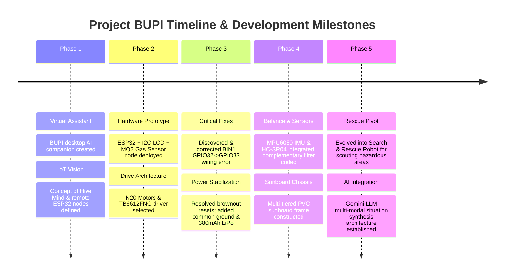

# PROJECT BUPI: COMPLETE ENGINEERING HISTORY & EVOLUTION

---

## 1. ORIGIN OF BUPI

### How the Idea Started
Project **BUPI** originated as a software-based AI virtual assistant and desktop companion created by Sachin. Initially, BUPI was designed as an interactive, intelligent entity living on the Windows desktop, featuring an anime-inspired voice, customizable emotions, and productivity tools (managing notes, drafting WhatsApp messages, setting reminders, and displaying announcements).

### The Problem Initially Targeted
While BUPI was effective as a virtual desktop assistant, a purely digital presence was inherently limited. The goal evolved to bridge the gap between software AI and the physical world. The core problem to solve became: **How can a software-based AI agent observe, physically navigate, and interact with the real world through modular hardware nodes?**

### What BUPI Originally Meant / Represented
The name **BUPI** (also referred to in early logs as *Bupi OSGO* or the *Hive Mind Hub*) represented a unified intelligence framework. In this architecture, BUPI acts as the central brain ("Hive Mind"), while microcontrollers (ESP32 nodes) act as physical limbs, eyes, and ears that execute actions and report telemetry back to the main system.

### Inspiration Behind the Project
The project was inspired by the concept of **Physical AI and Robotics**—combining high-level Large Language Models (LLMs) with real-time embedded systems. Rather than building an isolated, dumb remote-controlled car, BUPI was envisioned as a smart, autonomous, multi-sensor mobile agent.

### First Version of the Idea
The initial iteration consisted of:
1. A Python desktop application running speech-to-text, LLM decision logic, and visual UI widgets.
2. A fixed ESP32 hardware node (`BupiNode.ino` / `esp32_hive_display.ino`) with a 16x2 I2C LCD display and an MQ2 gas sensor connected over local Wi-Fi via MQTT (`bupi/nodes/announce` and `bupi/actuators/lcd/cmd`).

### Original Goals
- Establish non-blocking, zero-latency Wi-Fi communication (WebSockets & MQTT) between PC and ESP32.
- Transition BUPI from a stationary desk display node into a mobile, two-wheel robotic platform.
- Integrate environment sensing (smoke, obstacle distance, spatial orientation) into BUPI's cognitive loop.

---

## 2. EARLY DEVELOPMENT

### First Hardware and Software Components Considered
- **Microcontroller**: ESP32 Dev Module (38-pin), Arduino Uno, ESP8266.
- **Actuators**: Dual DC Gear Motors, N20 Micro Metal Gear Motors, SG90 Servo Motors.
- **Motor Drivers**: L298N Dual H-Bridge module, TB6612FNG Dual MOSFET driver.
- **Displays & Sensors**: 16x2 I2C LCD (PCF8574), MQ2 Smoke/LPG Sensor, HC-SR04 Ultrasonic Distance Sensor, MPU6050 6-DOF IMU.
- **Software Stack**: Arduino IDE, C++ / ESP32 Core, Python 3.12 (Bupi Hub Backend), Mosquitto MQTT Broker, WebSockets.

### Component Selection Rationale

#### Why ESP32?
- **Built-in Connectivity**: Integrated 2.4GHz Wi-Fi (802.11 b/g/n) and Bluetooth (BLE/v4.2).
- **Processing Power**: Dual-core Tensilica LX6 operating at 240 MHz with 520 KB SRAM—far superior to 8-bit microcontrollers for simultaneous sensor reading, filtering, and network streaming.
- **Peripherals**: Abundant GPIOs, hardware I2C/SPI busses, and dedicated hardware PWM (`ledc`) channels for high-frequency motor driving.

#### Why N20 Micro Metal Gear Motors?
- **Form Factor & Weight**: Extremely compact and lightweight, making them optimal for a miniature two-wheel balance chassis.
- **Durability & Torque**: Full metal gearboxes (100–300 RPM options) deliver high torque without the fragility of plastic hobby motor gears.
- **Current Efficiency**: Low idle current draw (~60mA) with manageable stall currents (~300–500mA).

#### Why TB6612FNG Motor Driver?
- **High Efficiency**: Uses low-resistance MOSFET H-bridges instead of bipolar transistors.
- **Minimal Voltage Drop**: Unlike the legacy L298N which drops ~1.8V–2.0V across internal transistors as heat, the TB6612FNG incurs negligible voltage drop, preserving precious battery voltage.
- **Thermal Performance**: Does not require heavy heatsinks.
- **Standby Pin (`STBY`)**: Allows software-controlled ultra-low-power standby mode when motors are idle.

### Alternatives Considered and Rejected
- **L298N Motor Driver**: *Rejected*. Highly inefficient for small LiPo battery power; bulky and heavy; excessive heat generation and large voltage drop.
- **Arduino Uno / Nano**: *Rejected*. Lacks native Wi-Fi/Bluetooth; only 2 KB RAM; insufficient clock speed to handle real-time IMU complementary filtering alongside Wi-Fi MQTT polling.
- **SG90 Servo Motors**: *Evaluated for continuous drive, rejected*. Limited rotation range (unless modified) and poor high-speed directional control compared to DC gear motors with PWM drivers.

### Early Experiments & Prototypes
1. **LCD Text Node Test**: Programmed ESP32 to connect to local Wi-Fi, subscribe to `bupi/actuators/lcd/cmd`, and display messages sent from Python (`esp32_bupi_client.ino`).
2. **MQ2 Gas Sensor Streaming**: Read analog pin 34 on ESP32, converted gas levels to JSON, and published payloads to `bupi/sensors/mq2/state`.
3. **Breadboard Motor Control**: Wired ESP32 to TB6612FNG on a breadboard to test basic direction outputs (`AIN1`, `AIN2`, `BIN1`, `BIN2`) and PWM speed modulation (`PWMA`, `PWMB`).

### Initial Wiring & Code Setup
- Connected ESP32 GPIOs to TB6612 control inputs using Dupont jumper wires.
- Created simple test sketches in Arduino IDE utilizing `digitalWrite()` for directional logic and `analogWrite()` / `ledcWrite()` for speed control.

### First Successful Test
The first milestone was achieved when sending keyboard teleoperation commands (`W`, `S`, `A`, `D`) from a Python serial script caused both N20 motors to rotate forward, reverse, left, and right on the bench setup.

---

## 3. DEVELOPMENT JOURNEY



### Detailed Chronological Step Analysis

#### Step 1: Hive Mind Architecture Definition
- **What was tried**: Establishing MQTT and WebSocket protocols to communicate between Python AI host and ESP32.
- **Why**: Needed a robust networking layer before adding physical mobility.
- **What worked**: Non-blocking loop structure using `PubSubClient` and `millis()` timers.
- **What failed**: Early sketches using `delay()` caused MQTT client dropouts and high latency.
- **Fix & Lesson**: Enforced BUPI Architectural Rule 2—*Strip out all blocking `delay()` calls; use non-blocking `millis()` timers.*

#### Step 2: Motor Driver Integration & The BIN1 Bug
- **What was tried**: Wiring ESP32 to TB6612FNG driver to control dual N20 motors.
- **Why**: Provide directional mobility for the robot.
- **What worked**: Motor A (Left) operated perfectly.
- **What failed**: Motor B (Right) failed to rotate or responded erratically during direction commands.
- **Mistake made**: **BIN1 pin of TB6612FNG was physically wired to ESP32 GPIO32 instead of GPIO33** as defined in the software header.
- **How discovered**: Traced logic levels with a multimeter across ESP32 output pins while executing motor test commands. Output pin 33 was toggling in software, but physical pin 32 was connected to BIN1.
- **How fixed**: Moved BIN1 jumper wire from GPIO32 to GPIO33 on the ESP32 board.
- **What learned**: Always cross-reference physical pinouts against software `#define` statements before troubleshooting hardware failures.

#### Step 3: Power System & Brownout Debugging
- **What was tried**: Powering ESP32 and motors from small earbud batteries and single 230 mAh LiPo cells.
- **Why**: Maintain a compact, lightweight robot profile.
- **What worked**: Logic circuits powered fine when stationary.
- **What failed**: ESP32 continuously rebooted with `Brownout detector was triggered` whenever motors accelerated.
- **Mistake made**: Shared high-impedance power rail without decoupling capacitors or separate motor current paths. Motor inrush current pulled VCC below ESP32 minimum operating threshold (~2.8V).
- **How fixed**:
  1. Implemented a **Common Ground Architecture** (linking battery GND, ESP32 GND, and TB6612 GND).
  2. Added a 100 µF electrolytic decoupling capacitor across the motor power supply rail.
  3. Upgraded the main power source to a 380 mAh LiPo battery.
- **What learned**: Inductive motor loads create severe voltage dips; logic power must be isolated or decoupled from motor power rails while sharing a single unified ground.

#### Step 4: Spatial Orientation & MPU6050 Addition
- **What was tried**: Adding MPU6050 6-axis IMU over I2C bus.
- **Why**: Required tilt angle measurement to enable two-wheel self-balancing capabilities.
- **What worked**: Raw accelerometer and gyroscope data acquisition.
- **What failed**: Raw accelerometer data was noisy during motor movement; raw gyroscope data drifted over time.
- **Fix & Lesson**: Implemented a **Complementary Filter** to fuse high-frequency gyro integration with low-frequency accelerometer gravity sensing.

---

## 4. HARDWARE HISTORY

| Component | Purpose | Status | Key Specifications | Connection Details |
| :--- | :--- | :--- | :--- | :--- |
| **ESP32 Dev Module** | Main Microcontroller & Communication Hub | **Currently Used** | Dual-core 240MHz, 520KB SRAM, 4MB Flash, 2.4GHz Wi-Fi, Bluetooth | Central processor |
| **N20 Motors (x2)** | Chassis Propulsion & Balance Drive | **Currently Used** | 6V Micro Metal Gearbox, 100-300 RPM, ~300mA stall current | Connected to TB6612 `AO1/AO2` & `BO1/BO2` |
| **TB6612FNG Module** | Dual MOSFET H-Bridge Motor Driver | **Currently Used** | 1.2A continuous / 3.2A peak per channel, low RDS(on) | `PWMA` (25), `AIN1` (26), `AIN2` (27), `PWMB` (14), `BIN1` (33), `BIN2` (32), `STBY` (4/3.3V) |
| **MPU6050 IMU** | 6-Axis Motion Tracking (Accel + Gyro) | **Currently Used / Under Test** | I2C Address `0x68`, 3-axis accel ($\pm 2g$), 3-axis gyro ($\pm 250^\circ/s$) | `SDA` -> GPIO21, `SCL` -> GPIO22, `VCC` -> 3.3V, `GND` -> GND |
| **HC-SR04 Sensor** | Ultrasonic Obstacle Ranging | **Currently Used** | 40kHz sonic burst, 2cm - 400cm range, $15^\circ$ beam angle | `Trig` -> GPIO5, `Echo` -> GPIO18 (via voltage divider) |
| **16x2 I2C LCD** | Local Status & Text Display | **Currently Used** | HD44780 + PCF8574 I2C backpack, Address `0x27` (or `0x3F`) | `SDA` -> GPIO21, `SCL` -> GPIO22, `VCC` -> 5V, `GND` -> GND |
| **MQ2 Gas Sensor** | LPG, Smoke, and Combustible Gas Detection | **Currently Used** | SnO2 catalytic sensor, analog output 0-3.3V | `A0` -> GPIO34 (ADC1), `VCC` -> 5V, `GND` -> GND |
| **Earbud Batteries** | Micro Power Source Prototype | **Rejected** | ~30-50 mAh Li-ion, high internal resistance | Tested for micro logic power; failed under load |
| **230 mAh 1S LiPo** | Compact Prototype Battery | **Tested / Backup** | 3.7V nominal, 1S cell | Tested for early low-power motor runs |
| **380 mAh 1S LiPo** | Primary Prototype Power Supply | **Currently Used** | 3.7V nominal, 25C discharge rate | Powers motor rail and ESP32 regulator |
| **1000 mAh 1S LiPo** | Extended Operational Power | **Future Planned** | 3.7V nominal, high capacity | Planned for multi-sensor payload drive |
| **TP4056 Module** | LiPo Battery Charging & Protection | **Planned** | 1A charge rate, micro-USB/Type-C, DW01A protection IC | Connects between USB input and 1S LiPo battery |
| **Sunboard (3mm)** | Lightweight Chassis Plates | **Currently Used** | 3mm PVC Foam Board, lightweight, rigid, easy to cut | Form-cut stacked chassis decks |
| **ESP32-CAM** | Visual Feed & AI Image Stream | **Future Planned** | OV2640 2MP camera module, microSD slot | Future high-level vision node |
| **AMG8833 Grid-EYE** | Thermal Infrared Array Sensor | **Future Planned** | 8x8 thermal pixel grid ($0^\circ C$ to $80^\circ C$) | Future I2C thermal detection node |
| **INMP441 Mic** | Acoustic & Voice Localization | **Future Planned** | Digital I2S MEMS microphone | Future I2S audio listening node |
| **MQ135 / SCD30** | CO2 & Air Quality Sensor | **Future Planned** | CO2 survivor respiration detection | Future environmental sensing node |

---

## 5. WIRING HISTORY

### Wiring Evolution & Pin Architecture

```
                       +-----------------------+
                       |     ESP32 DEV KIT     |
                       +-----------------------+
                            |             |
        +-------------------+             +--------------------+
        | I2C Bus (SDA:21, SCL:22)                             | GPIO Controls
        v                                                      v
  +-----------+   +---------------+                   +-----------------+
  | MPU6050   |   | 16x2 I2C LCD  |                   | TB6612FNG MOTOR |
  | (0x68)    |   | (0x27)        |                   | DRIVER MODULE   |
  +-----------+   +---------------+                   +-----------------+
                                                        | PWMA  -> GPIO25
  +------------------+                                  | AIN1  -> GPIO26
  | HC-SR04 ULTRASONIC|                                 | AIN2  -> GPIO27
  +------------------+                                  | PWMB  -> GPIO14
  | Trig -> GPIO5    |                                  | BIN1  -> GPIO33  <-- [CORRECTED]
  | Echo -> GPIO18   |                                  | BIN2  -> GPIO32
  +------------------+                                  | STBY  -> GPIO4
                                                        +-----------------+
  +------------------+                                    |             |
  | MQ2 GAS SENSOR   |                                    v             v
  +------------------+                                +-------+     +-------+
  | A0   -> GPIO34   |                                | MOTOR |     | MOTOR |
  +------------------+                                |   A   |     |   B   |
                                                      +-------+     +-------+
                                                          (Left)       (Right)
  ===========================================================================
  POWER & GROUND ARCHITECTURE:
  [ 3.7V LiPo Battery (+) ] ---> TB6612 (VM) & ESP32 (VIN / Boost Input)
  [ COMMON GROUND (-)     ] ---> ESP32 GND == TB6612 GND == Sensor GND == Battery GND
  ===========================================================================
```

### Complete ESP32 Pin Map

- **I2C Bus**:
  - `GPIO21` -> `SDA` (Shared between MPU6050 and I2C LCD Backpack)
  - `GPIO22` -> `SCL` (Shared between MPU6050 and I2C LCD Backpack)
- **TB6612FNG Motor Driver**:
  - `GPIO25` -> `PWMA` (Speed control Left Motor A)
  - `GPIO26` -> `AIN1` (Direction 1 Left Motor A)
  - `GPIO27` -> `AIN2` (Direction 2 Left Motor A)
  - `GPIO14` -> `PWMB` (Speed control Right Motor B)
  - `GPIO33` -> `BIN1` (**CORRECTED**: Direction 1 Right Motor B)
  - `GPIO32` -> `BIN2` (Direction 2 Right Motor B)
  - `GPIO4`  -> `STBY` (Module Enable / Standby, active HIGH)
- **Sensors**:
  - `GPIO5`  -> HC-SR04 `Trig`
  - `GPIO18` -> HC-SR04 `Echo` (via 10k/20k voltage divider to protect 3.3V logic)
  - `GPIO34` -> MQ2 Gas Sensor `A0` (ADC1 channel)

### Power & Ground Architecture
- **Common Ground Rule**: A single unified ground plane connects ESP32 `GND`, TB6612 `GND`, sensor `GND` pins, and the negative battery terminal. This ensures all logic signals maintain a constant 0V reference.
- **Power Delivery**: The 3.7V LiPo battery supplies motor power directly to TB6612 `VM`. A small DC boost converter raises 3.7V to 5.0V to feed the ESP32 `VIN` pin and 5V sensor rails (LCD, HC-SR04, MQ2).

### The BIN1 Debugging Event
During initial motor tests, Motor A responded properly, but Motor B failed to rotate. Tracing the circuit revealed that **BIN1 was accidentally wired to GPIO32**, creating a pin conflict where both `BIN1` and `BIN2` were tied to the same software signal. 

**Correction**: `BIN1` was rewired to `GPIO33`, matching the software configuration (`#define BIN1_PIN 33`). Motor B instantly functioned properly with full forward, reverse, and PWM speed control.

---

## 6. SOFTWARE HISTORY

### Environment & Tools
- **IDE**: Arduino IDE 2.x configured with Espressif ESP32 Board Manager (`v2.0.+`).
- **Board Settings**: `ESP32 Dev Module`, Flash Frequency `80MHz`, Upload Speed `921600 baud`.
- **Serial Monitor**: Standardized at `115200 baud`.

### Used Libraries
- `<WiFi.h>`: ESP32 native Wi-Fi stack.
- `<PubSubClient.h>`: Lightweight MQTT client library for node communication.
- `<WebSocketsClient.h>`: Low-latency WebSocket connection to Bupi Hub.
- `<Wire.h>`: I2C bus master library.
- `<LiquidCrystal_I2C.h>`: I2C driver for HD44780 displays.
- `<ArduinoJson.h>`: JSON serialization/deserialization for node announcements and telemetry.

### Software Code Artifacts

#### 1. Node Announcement & Heartbeat (`BupiNode.ino` Snippet)
```cpp
// Non-blocking 5-second Heartbeat
static unsigned long lastHeartbeat = 0;
if (millis() - lastHeartbeat > 5000) {
  lastHeartbeat = millis();
  if (client.connected()) {
    String heartbeat = "{\"device\":\"MQ2 Gas & LCD Display\",\"client_id\":\"" 
                       + clientId + "\",\"ip\":\"" + WiFi.localIP().toString() 
                       + "\",\"capabilities\":[\"Display\",\"Sensor\"],\"status\":\"online\"}";
    client.publish("bupi/nodes/heartbeat", heartbeat.c_str());
  }
}
```

#### 2. Non-Blocking Ultrasonic Distance Measurement
```cpp
float readUltrasonicDistance(int trigPin, int echoPin) {
  digitalWrite(trigPin, LOW);
  delayMicroseconds(2);
  digitalWrite(trigPin, HIGH);
  delayMicroseconds(10);
  digitalWrite(trigPin, LOW);
  
  long duration = pulseIn(echoPin, HIGH, 26000); // 26ms timeout (~4m)
  if (duration == 0) return -1.0; // Out of range
  return (duration * 0.0343) / 2.0; // Distance in cm
}
```

#### 3. MPU6050 Complementary Filter Logic
```cpp
// Fuses fast gyroscope integration with stable accelerometer gravity vector
float dt = (currentMicros - previousMicros) / 1000000.0;
float accelAnglePitch = atan2(accY, accZ) * 180.0 / M_PI;
pitchAngle = 0.98 * (pitchAngle + gyroRateX * dt) + 0.02 * accelAnglePitch;
```

#### 4. Motor Direction & PWM Control Matrix
```cpp
void setMotorState(int speedA, int speedB) {
  // Motor A (Left)
  if (speedA > 0) {
    digitalWrite(AIN1_PIN, HIGH); digitalWrite(AIN2_PIN, LOW);
  } else if (speedA < 0) {
    digitalWrite(AIN1_PIN, LOW);  digitalWrite(AIN2_PIN, HIGH);
  } else {
    digitalWrite(AIN1_PIN, LOW);  digitalWrite(AIN2_PIN, LOW);
  }
  ledcWrite(CHANNEL_A, abs(speedA));

  // Motor B (Right)
  if (speedB > 0) {
    digitalWrite(BIN1_PIN, HIGH); digitalWrite(BIN2_PIN, LOW);
  } else if (speedB < 0) {
    digitalWrite(BIN1_PIN, LOW);  digitalWrite(BIN2_PIN, HIGH);
  } else {
    digitalWrite(BIN1_PIN, LOW);  digitalWrite(BIN2_PIN, LOW);
  }
  ledcWrite(CHANNEL_B, abs(speedB));
}
```

---

## 7. DEBUGGING JOURNAL

| Problem | What Was Observed | Investigation | Cause | Fix | Result |
| :--- | :--- | :--- | :--- | :--- | :--- |
| **Motor B Not Working** | Motor A rotated properly; Motor B remained completely stationary | Measured logic levels on motor driver input pins using a multimeter | `BIN1` jumper wire was physically connected to GPIO32 instead of GPIO33 | Rewired `BIN1` jumper wire to GPIO33 on the ESP32 board | Motor B functioned perfectly with full directional and PWM control |
| **Unreadable Serial Output** | Serial Monitor displayed random garbage characters (e.g. `????`) | Checked software setup against IDE Serial Monitor settings | Serial Monitor drop-down was set to default 9600 baud, but sketch initialized `Serial.begin(115200)` | Set IDE Serial Monitor speed setting to 115200 baud | Crisp, readable diagnostic and telemetry logs appeared |
| **Serial Monitor Blank** | Terminal opened but showed zero text output after sketch upload | Inspected USB cable, COM port connection, and code execution flow | Code lacked startup delay, or ESP32 was stuck in bootloader state | Pressed ESP32 RESET button and added `delay(100)` after `Serial.begin(115200)` | Startup banner "ESP32 Booted..." displayed immediately |
| **MPU6050 Not Found** | Arduino sketch output: `"MPU6050 connection failed / device not found"` | Uploaded I2C scanner sketch to probe all bus addresses | Loose SDA/SCL Dupont wires on breadboard; unconfirmed I2C address | Resoldered/secured jumper wires and verified I2C address `0x68` | MPU6050 initialized successfully and began streaming IMU data |
| **I2C Scanner Finding 0x68** | Unsure whether MPU6050 address was `0x68` or `0x69` | Ran I2C bus scanner script | `AD0` pin was pulled LOW by internal resistor, setting address to `0x68` | Instantiated library with `mpu.begin(0x68)` in software code | Reliable and consistent I2C sensor communications established |
| **Upload / Bootloader Timeout** | IDE error: `Failed to connect to ESP32: Timed out waiting for packet header` | Monitored ESP32 auto-program circuit during compilation upload phase | Missing auto-reset capacitor on `EN` line preventing automatic boot mode entry | Manually held physical `BOOT` button on ESP32 while IDE displayed `"Connecting..."` | Sketch compiled and flashed successfully into ESP32 flash memory |
| **Brownout Resets Under Load** | ESP32 randomly rebooted with brownout log whenever motors turned ON | Measured 3.3V/5V power rail voltage drop during motor acceleration | Motors drew high peak inrush current from weak power source, pulling VCC below ~2.8V | Added 100uF decoupling capacitor across motor rail & implemented common GND | ESP32 operated continuously without brownouts during motor start |
| **Battery Voltage Sag** | Motors spun weakly or stalled when using earbud batteries | Evaluated current draw and discharge C-rate under load | Earbud batteries (~30mAh) could not supply ~300mA peak motor current | Replaced earbud batteries with a 380 mAh 1S LiPo battery pack | Full speed and motor torque achieved |
| **LCD Displaying Black Boxes** | 16x2 LCD display showed 16 solid blocks on the top row | Verified I2C wiring and contrast potentiometer on back of I2C backpack | Contrast potentiometer was misadjusted; I2C address needed verification | Adjusted contrast potentiometer with screwdriver and confirmed address `0x27` | Text `"BUPI LCD Node"` appeared clearly with bright backlighting |

---

## 8. MPU6050 DEVELOPMENT

### Why It Was Added
The MPU6050 6-axis Inertial Measurement Unit (IMU) was introduced to provide spatial orientation, inclination tracking, and real-time angular velocity data.

### Why Necessary for a Two-Wheel Robot
A two-wheel robot is an **inverted pendulum** system, which is inherently unstable. Without an IMU to continuously report pitch angle ($\theta$) and angular velocity ($\frac{d\theta}{dt}$), the microcontroller cannot calculate the required motor acceleration to keep the center of gravity above the wheel axis.

### Testing & Verification
1. **I2C Address Scanning**: Confirmed address `0x68` on the I2C bus (`SDA`: GPIO21, `SCL`: GPIO22).
2. **Raw Data Verification**: Streamed raw accelerometer ($A_x, A_y, A_z$) and gyroscope ($G_x, G_y, G_z$) values over the Serial Plotter to verify sensor orientation.

### Sensor Fusion & Complementary Filter
- **Accelerometer**: Computes static tilt angle using $\theta_{acc} = \text{atan2}(A_y, A_z) \cdot \frac{180}{\pi}$. Accurate over long timeframes, but noisy during motor movement/vibrations.
- **Gyroscope**: Integrates angular velocity over time ($\theta_{gyro} = \theta_{prev} + G_x \cdot dt$). Very smooth and fast, but suffers from low-frequency drift over time.
- **Complementary Filter Formula**:
  $$\theta_{angle} = \alpha \cdot (\theta_{angle} + G_x \cdot dt) + (1 - \alpha) \cdot \theta_{acc}$$
  *(where $\alpha = 0.98$)*. Fuses the fast response of the gyroscope with the long-term stability of the accelerometer.

### Future PID Balancing Control Loop
The calculated tilt angle feeds into a Proportional-Integral-Derivative (PID) controller:
$$u(t) = K_p \cdot e(t) + K_i \int_{0}^{t} e(\tau)d\tau + K_d \cdot \frac{de(t)}{dt}$$
Where error $e(t) = \theta_{target} - \theta_{current}$. The control output $u(t)$ directly drives motor PWM values to maintain upright balance.

---

## 9. TWO-WHEEL ROBOT DECISION

```
   [ 2-Wheel + Caster Wheel (3-Point) ]         [ True 2-Wheel Self-Balancing ]
   +----------------------------------+         +-------------------------------+
   | - Passively Stable               |         | - Actively Balanced (IMU/PID) |
   | - Bulky Ground Footprint         |         | - Minimal Ground Footprint    |
   | - Easily Trapped by Rubble       |         | - High Agility & 360-Degree   |
   | - Low Engineering Challenge      |         |   In-Place Rotation           |
   +----------------------------------+         | - Superior Confined-Space     |
                                                |   Scouting Capability         |
                                                +-------------------------------+
                                                                ^
                                                                |
                                                    [ INTENTIONALLY CHOSEN ]
```

### Comparison Matrix
1. **Two-Wheel + Caster Wheel (3-Point Contact)**:
   - *Pros*: Simple differential drive; passively stable without active balancing control loops.
   - *Cons*: Larger ground footprint; caster wheel frequently catches on cracks, cables, or rubble; poor agility in tight vertical spaces.
2. **True Two-Wheel Self-Balancing Robot (Inverted Pendulum)**:
   - *Pros*: Minimal ground contact footprint; can rotate 360 degrees in place on a single line; capable of leaning into inclines and traversing narrow gaps; high maneuverability for rescue scouting.
   - *Cons*: Requires real-time control loops, fast sensor fusion, and precise motor response.

### Selection Rationale
The project intentionally selected the **true two-wheel self-balancing architecture** to push engineering limits and achieve maximum agility in narrow, hazardous environments.

---

## 10. POWER SYSTEM

### Battery Evaluation History
- **Earbud Batteries (~30-50 mAh)**: Tested for ultra-compact logic power. *Rejected*: Severe voltage drop under load due to high internal resistance and low discharge C-rate.
- **230 mAh 1S LiPo**: Compact cell used during initial breadboard testing. *Status*: Working for low-power tests; rapid depletion under continuous motor run.
- **380 mAh 1S LiPo**: Primary operational battery for the current prototype chassis. *Status*: Currently Used; provides a solid balance of weight, form factor, and discharge capacity.
- **1000 mAh 1S LiPo**: Planned future battery upgrade to support multi-sensor payloads (camera, thermal, gas) and extended field operational time.

### Power Architecture & Specifications
- **Nominal Cell Voltage**: 3.7V (Full charge: 4.2V, Cutoff: 3.0V).
- **Charging Module**: TP4056 lithium battery charger board featuring a Type-C USB interface and DW01A protection IC (protecting against over-charging, over-discharging, and short circuits).
- **Voltage Regulation**: A step-up DC-DC boost converter converts 3.7V battery voltage to a regulated 5.0V rail to feed the ESP32 `VIN` pin and 5V sensor peripherals (LCD, HC-SR04, MQ2).
- **Current Requirements**:
  - ESP32 MCU: ~80-160 mA (peaks up to 250 mA during Wi-Fi transmissions).
  - Dual N20 Motors: ~120 mA total running free, up to 600 mA combined stall current.
  - Peak Power Budget: ~850 mA.

---

## 11. MECHANICAL DESIGN

### Chassis Material: PVC Sunboard
Sunboard (3mm PVC foam sheet) was selected for prototype chassis construction due to its high strength-to-weight ratio, structural rigidity, low cost, and ease of custom cutting with a utility knife.

### Structural Stack & Component Placement
The chassis features a 3-tier vertical stack (~15cm height x 8cm width):
1. **Bottom Tier**: Dual N20 motor brackets, rubber traction wheels, and TB6612FNG motor driver module.
2. **Middle Tier**: 380 mAh LiPo battery compartment and **MPU6050 IMU**.
3. **Top Tier**: ESP32 Dev Board, HC-SR04 ultrasonic sensor, and 16x2 LCD display.

```
       +------------------------------------+
       |  TOP TIER: ESP32 + HC-SR04 + LCD   |
       +------------------------------------+
                         |
       +------------------------------------+
       |  MIDDLE TIER: Battery + MPU6050    |  <-- [Center of Rotation / CoG]
       +------------------------------------+
                         |
       +------------------------------------+
       |  BOTTOM TIER: TB6612 + N20 Motors  |
       +------------------------------------+
                     (O)    (O)                 <-- [Wheel Axis]
```

### Center of Gravity & Sensor Placement
- **Battery Placement**: Positioned on the middle tier near the central pivot axis to lower the moment of inertia for responsive self-balancing control.
- **MPU6050 Placement**: Mounted precisely along the central axis of rotation to minimize false centrifugal acceleration artifacts during rapid tilts.

### Future Mechanical Upgrades
Transitioning from hand-cut sunboard prototype plates to a 3D-printed PETG/ABS modular enclosure featuring rubber shock-absorption mounts.

---

## 12. RESCUE ROBOT EVOLUTION

### Transition from Companion to Rescue Robot
As BUPI's sensor suite and mobility architecture matured, the project evolved from a general virtual companion into a specialized **Search-and-Rescue Scouting Robot**.

### Intended Rescue Scenarios
- **Collapsed Buildings & Earthquake Rubble**: Navigating tight voids and crevices inaccessible to human first-responders.
- **Confined Spaces & Ductwork**: Scouting industrial pipes and collapsed corridors.
- **Hazardous Environments**: Detecting gas leaks (LPG, smoke) and environmental threats before sending human teams inside.

### Realistic Engineering Limitations
- **Concrete Thermal Barrier**: Thermal sensors (e.g. AMG8833) **cannot see through solid concrete walls**. Infrared radiation is blocked by solid structural materials. Thermal arrays can only detect surface heat emissions, hot air venting through cracks, or heat radiating from open gaps.
- **Reporting Protocol**: BUPI is engineered to report `"possible survivor detected"` or `"thermal/acoustic anomaly found"` rather than making absolute, unverified claims.

---

## 13. SENSOR-FUSION CONCEPT

BUPI incorporates a multi-sensor complementary matrix to evaluate hazardous environments:

```
                          +-------------------------+
                          |   MULTI-SENSOR MATRIX   |
                          +-------------------------+
                                       |
    +------------------+---------------+---------------+------------------+
    |                  |               |               |                  |
    v                  v               v               v                  v
+-----------+    +-----------+   +-----------+   +-----------+      +-----------+
| ULTRASONIC|    |  CAMERA   |   | AUDIO MIC |   |  THERMAL  |      | GAS / CO2 |
| (HC-SR04) |    | (ESP32)   |   | (INMP441) |   | (AMG8833) |      |   (MQ2)   |
+-----------+    +-----------+   +-----------+   +-----------+      +-----------+
  Distance &       Visual Feed     Distress        Heat Grid          Hazardous
  Obstacle         & Vision AI     Acoustics       Detection          Smoke & Gas
  Avoidance
```

### Complementary Sensor Matrix Logic
- **Obstacle Avoidance**: Ultrasonic sensor detects physical wall; IMU ensures robot stability over uneven terrain.
- **Survivor Verification**: If ultrasonic sensor detects an obstacle, thermal camera scans for surface heat signatures ($36^\circ C - 37^\circ C$), microphone listens for distress calls, and gas sensors analyze CO2/smoke concentrations.
- **Decision Fusion**: Combining distance + thermal anomaly + sound localization yields high-confidence situational reports for operators.

---

## 14. GEMINI / AI INTEGRATION

### Architecture: Local Real-Time Control vs. High-Level AI

```
+-------------------------------------------------------------------+
|                     HIGH-LEVEL AI (PC / CLOUD)                    |
|                                                                   |
|  - Gemini 1.5/2.0 Multi-Modal Vision & Sensor Interpretation     |
|  - Situational Awareness Summaries & Survivor Risk Alerts        |
|  - Operator Voice & Desktop Command Interface ("Bupi Hub")       |
+-------------------------------------------------------------------+
                                  ^
                                  |  (Wi-Fi / WebSockets / MQTT)
                                  v
+-------------------------------------------------------------------+
|                 REAL-TIME LOCAL CONTROL (ESP32 MCU)               |
|                                                                   |
|  - PID Self-Balancing Motor Loop (100Hz - 500Hz)                  |
|  - MPU6050 Complementary Filter Data Acquisition                  |
|  - HC-SR04 Emergency Collision Avoidance                          |
|  - Hardware Safety Cutoffs & Deterministic Motor PWM              |
+-------------------------------------------------------------------+
```

### System Boundaries
- **Gemini AI does NOT directly control motor PWM loops in real-time** over Wi-Fi, avoiding network latency risks during balancing.
- **ESP32 MCU** executes deterministic, microsecond-level motor control and balancing loops locally.
- **Gemini AI** processes snapshot images, synthesizes multi-sensor trends, generates situational summaries, and assists human operators with high-level mission planning.

---

## 15. FUTURE ENHANCEMENTS ROADMAP

- **Phase 1: Basic Drive & Motor Control** — *COMPLETED*
- **Phase 2: Basic Sensor Integration (LCD, MQ2, HC-SR04)** — *WORKING*
- **Phase 3: Tilt Angle Measurement via MPU6050 & Complementary Filter** — *UNDER TEST*
- **Phase 4: PID Self-Balancing Loop Tuning** — *PLANNED*
- **Phase 5: Wireless Teleoperation & WebSockets Communication** — *WORKING*
- **Phase 6: Custom 3D-Printed Chassis & Power Module Upgrade** — *PLANNED*
- **Phase 7: ESP32-CAM Visual Feed Integration** — *PLANNED*
- **Phase 8: Audio MEMS Mic & AMG8833 Thermal Array Integration** — *PLANNED*
- **Phase 9: Gemini Multi-Modal High-Level AI Cognitive Layer** — *EXPANDING*
- **Phase 10: Rescue Scenario Obstacle Field Demonstration** — *PLANNED*
- **Phase 11: Field-Ready Ruggedized Rescue Robot** — *FUTURE PLAN*

---

## 16. CURRENT STATUS

- **COMPLETED**: ESP32 core setup, TB6612 motor driver integration, N20 motor driving code, MQTT telemetry protocol, LCD display node, I2C scanner debugging, BIN1 pin fix.
- **WORKING**: Keyboard teleoperation ('W','A','S','D','X'), HC-SR04 ultrasonic distance measurement, MQ2 gas sensing, non-blocking WebSockets telemetry.
- **UNDER TEST**: MPU6050 raw accel/gyro acquisition, complementary filter angle estimation, sunboard multi-tiered chassis assembly, 380 mAh LiPo power stability.
- **PLANNED**: PID self-balancing motor loop tuning, TP4056 charging circuit integration, 1000 mAh battery upgrade, ESP32-CAM visual streaming setup.
- **IDEA ONLY**: AMG8833 thermal grid array, INMP441 MEMS microphone audio localization, CO2 survivor respiration detection, field-ruggedized shockproof frame.

---

## 17. CURRENT BILL OF MATERIALS (BOM)

| Component | Quantity | Status | Approximate Cost | Purpose |
| :--- | :--- | :--- | :--- | :--- |
| **ESP32 Development Board (38-pin)** | 1 | Currently Used | ~₹350 - ₹500 | Main microcontroller & wireless hub |
| **N20 Micro Metal Gear Motors (6V)** | 2 | Currently Used | ~₹150 - ₹250 each | Chassis propulsion & balance actuation |
| **TB6612FNG Motor Driver Module** | 1 | Currently Used | ~₹120 - ₹200 | Dual MOSFET H-bridge motor driver |
| **MPU6050 6-Axis IMU Module** | 1 | Currently Used / Under Test | ~₹120 - ₹180 | Gyroscope + Accelerometer tilt sensor |
| **HC-SR04 Ultrasonic Sensor** | 1 | Currently Used | ~₹80 - ₹120 | Distance & obstacle detection |
| **MQ2 Gas Sensor Module** | 1 | Currently Used | ~₹100 - ₹150 | Smoke / LPG gas detection |
| **16x2 I2C LCD Display (PCF8574)** | 1 | Currently Used | ~₹200 - ₹300 | Local status & message display |
| **380 mAh 1S LiPo Battery** | 1 | Currently Used | ~₹200 - ₹350 | Main prototype power source |
| **TP4056 Charging Module** | 1 | Planned | ~₹30 - ₹50 | LiPo battery charger with protection |
| **Sunboard PVC Sheet (3mm)** | 1 | Currently Used | ~₹50 - ₹100 | Chassis structural decks |
| **Rubber Wheels for N20 Motors** | 2 | Currently Used | ~₹60 - ₹100 pair | Traction wheels |
| **Jumper Wires & Perfboard** | Assorted | Currently Used | ~₹100 | Circuit interconnections |

---

## 18. PROJECT MISTAKES AND LESSONS

1. **Pin Mapping Oversights**: Misconnecting `BIN1` to GPIO32 instead of GPIO33 highlighted the critical importance of keeping physical wiring diagrams synchronized with software headers before troubleshooting hardware.
2. **The Common Ground Requirement**: Attempting to run motors and microcontrollers on separate unlinked power sources caused erratic behavior. Establishing a single, unified 0V ground reference is mandatory for all embedded systems.
3. **Power Rail Decoupling**: High motor inrush current caused severe voltage sag and ESP32 brownout reboots. Adding decoupling capacitors and selecting high-discharge LiPo batteries resolved voltage instability.
4. **I2C Bus Diagnostics**: Assuming default I2C addresses often leads to failed communication. Utilizing an I2C scanner sketch to verify device addresses (`0x68` vs `0x69`, `0x27` vs `0x3F`) saved hours of software debugging.
5. **Realistic Sensor Capabilities**: Understanding physical limits (e.g. thermal infrared cannot penetrate solid concrete walls) prevents flawed architectural assumptions and ensures reliable rescue reporting.

---

## 19. PROJECT STORY

### From Desktop Assistant to Mobile Intelligent Rescue Robot

Project BUPI began not in a robotics lab, but on a desktop screen. Designed by Sachin, BUPI was born as an animated virtual assistant—a software companion with personality, created to help manage daily notes, display reminders, and automate messages. However, a software assistant trapped behind a glass screen could only observe a fraction of the real world. 

The ambition grew: **What if BUPI had a physical body?**

The journey into hardware began with simple ESP32 nodes connected over local Wi-Fi. First came an I2C LCD display node that printed BUPI's desktop status messages, followed by an MQ2 gas sensor that monitored ambient air quality. But stationary nodes were still limited. BUPI needed mobility.

To build a compact mobile platform, N20 micro metal gear motors and the high-efficiency TB6612FNG motor driver were selected over bulky legacy drivers. The path was not without obstacles: early motor tests were stymied by a frustrating wiring bug where `BIN1` was mistakenly plugged into GPIO32 instead of GPIO33, causing Motor B to freeze. Tracing signals with a multimeter revealed the mispinning, and fixing the jumper wire brought both wheels to life.

Next came the challenge of power. Small earbud batteries collapsed under the motors' startup current, triggering ESP32 brownout resets. Implementing a unified common ground architecture and upgrading to a 380 mAh LiPo battery stabilized the power rail.

With basic movement established, BUPI's physical form evolved into a multi-tiered Sunboard chassis equipped with an MPU6050 6-axis IMU. By applying a complementary filter to fuse accelerometer and gyroscope data, BUPI laid the foundation for true two-wheel self-balancing.

Finally, BUPI's mission transformed. Recognizing the potential of a hyper-agile, two-wheel self-balancing robot with a minimal footprint, BUPI evolved into a **Search-and-Rescue Scouting Robot**—designed to navigate collapsed structures, detect hazardous gases, scan for thermal anomalies, and stream data back to a high-level Gemini AI cognitive layer. 

What started as a simple desktop assistant script has transformed into an intelligent, physical robotic system bridging artificial intelligence and real-world rescue engineering.

---

## 20. MISSING INFORMATION & UNCERTAINTIES

- **Earbud Battery Discharge Rate**: Exact discharge C-rate and internal resistance of early earbud test cells `[NOT CONFIRMED]`.
- **PID Tuning Coefficients**: Final numerical values for Proportional ($K_p$), Integral ($K_i$), and Derivative ($K_d$) parameters for upright balancing `[FUTURE PLAN]`.
- **Thermal Sensor Model Selection**: Specific thermal sensor module to be integrated (AMG8833 Grid-EYE vs MLX90614) `[FUTURE PLAN]`.
- **CAD Specs for 3D Chassis**: Exact dimensional CAD drawings for the 3D-printed modular frame replacement `[FUTURE PLAN]`.
- **Field Test Obstacle Rig**: Physical layout parameters for the rescue obstacle demonstration course `[UNKNOWN / FUTURE PLAN]`.
