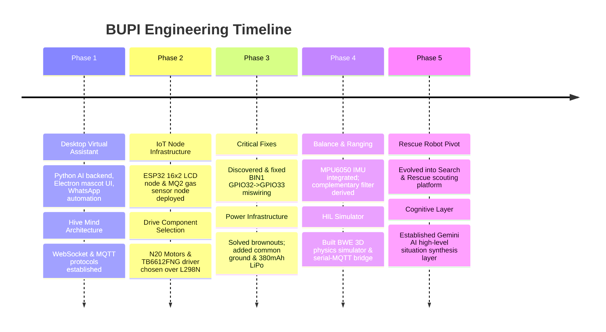

# PROJECT BUPI: TECHNICAL DOSSIER & EVOLUTION HANDOVER

> **Document Type**: AI-to-AI Technical Handover & System Specification  
> **Project Name**: BUPI (also known as *Bupi OSGO*, *Bupi Hub*, or *Project BUPI*)  
> **Repository Base**: `bunnybot1121/boopi` / `c:\Users\Sachin\boopi\assistant`  
> **Target Audience**: AI Engineering Assistants, Embedded Systems Developers, System Architects  

---

## 1. PROJECT IDENTITY & INCEPTION

### Project Identity & Original Vision
Project **BUPI** began as an intelligent, interactive AI virtual assistant and desktop companion created by Sachin. Initially envisioned as a desktop entity living on Windows, BUPI featured an anime-inspired voice, expressive virtual mascot animations (Three.js/Rive), and productivity tools (managing notes, drafting WhatsApp messages, setting reminders, and displaying status widgets).

### Core Problem Solved
A purely digital desktop assistant is constrained by the boundary of a computer monitor. The core problem BUPI addresses is:  
**How can an intelligent AI agent bridge digital reasoning with physical-world perception and interaction?**  
The project evolved to transform BUPI into a **modular, multi-node "Hive Mind" architecture**, where central software AI orchestrates mobile physical hardware nodes capable of navigating, sensing, and reporting on physical environments.

### Evolution Over Time
```
+--------------------------------+
|  1. Virtual Desktop Companion  |  - Python AI, Electron UI, Mascot, WhatsApp automation
+--------------------------------+
               |
               v
+--------------------------------+
|  2. IoT Node Infrastructure    |  - ESP32 microcontrollers over MQTT / WebSockets
+--------------------------------+
               |
               v
+--------------------------------+
|  3. Mobile Two-Wheel Base      |  - N20 Motors, TB6612 driver, MPU6050 IMU, HC-SR04
+--------------------------------+
               |
               v
+--------------------------------+
|  4. Search-and-Rescue Robot    |  - Scouting confined spaces, hazard gas/thermal sensing,
+--------------------------------+    Gemini AI multi-modal situation synthesis
```

---

## 2. TECH STACK & ARCHITECTURE

### Hardware Stack
- **Microcontroller**: ESP32 Dev Module (38-pin, 240 MHz dual-core Tensilica LX6, 520 KB SRAM, 4 MB Flash, 2.4 GHz Wi-Fi, Bluetooth).
- **Actuators**: Dual N20 Micro Metal Gear Motors (6V, 100–300 RPM) driven by a **TB6612FNG Dual MOSFET H-Bridge Motor Driver**.
- **Sensors**: 
  - **MPU6050**: 6-Axis Motion Tracking IMU (3-axis Accel + 3-axis Gyro, I2C address `0x68`).
  - **HC-SR04**: Ultrasonic Distance Ranging Sensor (2cm–400cm range).
  - **MQ2**: Analog Gas/Smoke/LPG Sensor (ADC Pin 34).
  - **16x2 I2C LCD Display**: HD44780 + PCF8574 I2C backpack (Address `0x27`).
- **Power System**: 380 mAh 1S 3.7V LiPo Battery, DC-DC 5V Step-Up boost converter, common ground architecture, TP4056 USB charging IC with DW01A protection.
- **Chassis**: Multi-tiered PVC Sunboard (3mm) lightweight structural decks (~15cm height x 8cm width).

### Software & Cloud Architecture
- **Desktop UI / Frontend**: Electron, HTML5, CSS3, Vanilla JS, Three.js 3D rendering, Rive mascot animations (`mascot_handler.js`, `notepad.js`, `three_handler.js`).
- **Backend Core**: Python 3.12 backend orchestrator (`main.py`, `ai_brain.py`, `config.py`, `db_manager.py`, `logger.py`).
- **Communication & Protocols**: 
  - **MQTT Broker**: Mosquitto (port 1883) for node pub/sub topics (`bupi/nodes/announce`, `bupi/nodes/heartbeat`, `bupi/actuators/lcd/cmd`, `bupi/sensors/mq2/state`).
  - **WebSockets Server**: Python WebSocket server (port 8767) for real-time desktop UI syncing.
  - **Serial-MQTT HIL Bridge**: Python bridge script (`bwe_serial_mqtt_bridge.py`).
- **AI & Vector Memory**:
  - LangChain + ChromaDB + SentenceTransformers (`brain/bupi.db` SQLite database, vector memory).
  - Multi-modal LLM integration (Gemini 1.5/2.0 API, Groq, OpenRouter).
- **Hardware-In-The-Loop (HIL) Simulator**:
  - **BWE (Bupi World Environment)**: JavaScript/Three.js 3D physics simulator (`bwe_simulator.js`, `launch_bwe_lab.js`, `bwe/core/engine.js`, `bwe/peripherals/gpio_manager.js`).
- **Firmware**: C++ / ESP32 Arduino Core (`workspace/BupiNode/BupiNode.ino`, `esp32_bupi_client.ino`, `esp32_hive_display.ino`, `esp32_bwe_mqtt_client.ino`).

### System Architecture Diagram

```
+---------------------------------------------------------------------------------+
|                                 BUPI HUB (PC MAIN)                              |
|                                                                                 |
|  +--------------------+   +---------------------+   +------------------------+  |
|  | Electron Desktop UI|   | Python Backend Core |   | Gemini AI / Cloud APIs |  |
|  | (Three.js/Mascot)  | <-> | (LangChain/ChromaDB)| <-> | (Multi-Modal Synthesis) |  |
|  +--------------------+   +---------------------+   +------------------------+  |
|                                     |                                           |
|                   +-----------------+-----------------+                         |
|                   |                                   |                         |
|                   v                                   v                         |
|      +-------------------------+         +--------------------------+           |
|      | Mosquitto MQTT Broker   |         | WebSockets Server        |           |
|      | (Port 1883)             |         | (Port 8767)              |           |
|      +-------------------------+         +--------------------------+           |
+-------------------^-----------------------------------^-------------------------+
                    |                                   |
                    | (Wi-Fi 802.11 b/g/n)              | (WebSockets)
                    v                                   v
+---------------------------------------------------------------------------------+
|                            ESP32 ROBOT HARDWARE NODE                            |
|                                                                                 |
|  +-------------------+    +--------------------+    +------------------------+  |
|  | TB6612 Motor Driver|    | MPU6050 IMU Sensor |    | Sensor Suite           |  |
|  | Dual N20 Motors   |    | (Complementary Ftr)|    | (HC-SR04 / MQ2 / LCD)  |  |
|  +-------------------+    +--------------------+    +------------------------+  |
+---------------------------------------------------------------------------------+
```

---

## 3. DEVELOPMENT TIMELINE & MILESTONES



### Phase Breakdown & Major Milestones

#### Phase 1: Virtual Assistant Foundation (Completed)
- Established Python desktop orchestrator, local SQLite memory (`bupi.db`), voice/speech processing, and interactive Electron desktop UI.
- Defined the "Hive Mind" concept: expanding software intelligence into physical hardware nodes.

#### Phase 2: IoT Node Protocol & Hardware Assembly (Completed)
- Built first ESP32 node running non-blocking MQTT loop, 5-second announcement/heartbeat schema (`bupi/nodes/announce`), I2C LCD display driver (`0x27`), and MQ2 gas sensor stream (`bupi/sensors/mq2/state`).
- Selected N20 micro metal gear motors and TB6612FNG dual MOSFET driver over bulky, inefficient L298N drivers.

#### Phase 3: Hardware Fixes & Power Stabilization (Completed)
- **The BIN1 Bug**: Discovered physical miswiring of TB6612 `BIN1` to GPIO32 instead of GPIO33; rewired to GPIO33, restoring Motor B functionality.
- **Power System Debugging**: Eliminated ESP32 brownout reboots by linking all grounds into a **Common Ground Architecture**, adding 100uF decoupling capacitors across motor rails, and upgrading to a high-discharge 380 mAh LiPo battery.

#### Phase 4: Spatial Motion & HIL Simulation (Working / Under Test)
- Integrated MPU6050 6-axis IMU over I2C (`0x68`) and derived a complementary filter formula ($\theta = 0.98(\theta + G_x dt) + 0.02 \theta_{acc}$) to fuse fast gyroscope dynamics with stable accelerometer gravity vectors.
- Implemented HC-SR04 ultrasonic distance ranging with pulse timing.
- Built **BWE (Bupi World Environment)**, a 3D Three.js Hardware-In-The-Loop (HIL) simulator to test virtual pin states against physical ESP32 boards via a low-latency serial bridge.

#### Phase 5: Search-and-Rescue Evolution & AI Layer (Active / Expanding)
- Pivoted BUPI into a Search-and-Rescue Scouting Robot for confined spaces (rubble, hazardous gas zones).
- Established clear architectural boundaries: local microsecond loops on ESP32 handle motor PWM and PID balancing, while cloud-based Gemini AI handles multi-sensor synthesis, image analysis, and operator reporting.

---

## 4. DEBUGGING & FIXES HISTORY

| Issue / Bug | Symptoms Observed | Root Cause Analysis | Resolution & Fix | Impact / Outcome |
| :--- | :--- | :--- | :--- | :--- |
| **Motor B Inoperation** | Motor A ran fine; Motor B remained dead during drive commands | Multimeter signal tracing showed no output on software-defined pin; physical wire was plugged into GPIO32 instead of GPIO33 | Moved `BIN1` jumper wire from GPIO32 to GPIO33 on ESP32 | Both Motor A and Motor B ran synchronously with full directional control |
| **ESP32 Brownout Reboots** | ESP32 randomly reset with `Brownout detector triggered` when motors started | Motor inrush current pulled shared power rail below ESP32 minimum operating voltage (~2.8V) | Established Common Ground, added 100uF decoupling capacitor across motor rail, and upgraded to 380 mAh LiPo | ESP32 operated continuously without brownouts during motor acceleration |
| **Garbage Serial Output** | Serial Monitor printed unreadable symbols (e.g. `????`) | Serial Monitor drop-down was set to 9600 baud, but sketch initialized `Serial.begin(115200)` | Changed Serial Monitor baud rate setting to 115200 baud | Clear, crisp diagnostic logs displayed instantly |
| **MPU6050 / LCD Bus Failure** | `"MPU6050 connection failed"` or blank LCD screen | Unverified I2C addresses and loose Dupont breadboard connections | Ran I2C Scanner to confirm addresses (`0x68` for MPU6050, `0x27` for LCD), secured wiring, and adjusted contrast pot | Reliable I2C sensor reading and clear LCD text display achieved |
| **ESP32 Upload Timeout** | IDE output: `Failed to connect: Timed out waiting for packet header` | Missing auto-reset capacitor on `EN` pin preventing automatic boot mode entry | Manually held physical `BOOT` button on ESP32 while IDE displayed `"Connecting..."` | Firmware uploaded successfully into ESP32 flash memory |
| **Battery Voltage Sag** | Motors spun weakly or stalled when using earbud batteries | Earbud batteries (~30mAh) could not supply ~300mA peak motor current due to high internal resistance | Replaced earbud batteries with high C-rate 380 mAh 1S LiPo battery pack | Full motor torque and speed achieved |

---

## 5. CURRENT STATUS & ROADMAP

### Current System Status
```
[ 100% FUNCTIONAL ] --------------------------------------------------------
- Python Desktop Backend, SQLite Memory & WebSocket/MQTT Broker Interfaces
- ESP32 Wi-Fi Auto-Reconnect, JSON Node Announcement & Heartbeat Telemetry
- 16x2 LCD Text Display Node & MQ2 Gas Sensor State Publisher Node
- TB6612FNG Dual Motor PWM Directional Control Matrix
- Keyboard Teleoperation Interface ('W','A','S','D','X')
- BWE Hardware-In-The-Loop (HIL) 3D Simulator & Serial-MQTT Bridge

[ ACTIVELY IN-DEVELOPMENT / UNDER TEST ] ------------------------------------
- MPU6050 Complementary Filter Angle Estimation ($\theta$)
- Multi-Tiered PVC Sunboard Chassis Balancing Prototype
- 380 mAh LiPo Power Stability & Boost Regulator Efficiency
- HC-SR04 Ultrasonic Distance Ranging Safety Cutoffs

[ PLANNED ROADMAP & NEXT IMMEDIATE STEPS ] ---------------------------------
- Step 1: Tune PID Control Loop ($K_p, K_i, K_d$) for Upright Self-Balancing
- Step 2: Integrate TP4056 Battery Charging Board with DW01A Protection
- Step 3: Add ESP32-CAM Video Stream for Gemini Vision Processing
- Step 4: Integrate AMG8833 Thermal Grid Array & INMP441 I2S MEMS Microphone
- Step 5: Replace Sunboard Prototype with Custom 3D-Printed PETG Chassis
```

---

## 6. PINOUT & WIRING QUICK-REFERENCE

```
ESP32 DEV MODULE PINOUT MAPPING:
===========================================================================
- I2C BUS:
    SDA ------------> GPIO 21 (Shared: MPU6050 & LCD Backpack)
    SCL ------------> GPIO 22 (Shared: MPU6050 & LCD Backpack)

- TB6612FNG MOTOR DRIVER:
    PWMA -----------> GPIO 25 (Speed Control Left Motor A)
    AIN1 -----------> GPIO 26 (Direction 1 Left Motor A)
    AIN2 -----------> GPIO 27 (Direction 2 Left Motor A)
    PWMB -----------> GPIO 14 (Speed Control Right Motor B)
    BIN1 -----------> GPIO 33 (Direction 1 Right Motor B - CORRECTED!)
    BIN2 -----------> GPIO 32 (Direction 2 Right Motor B)
    STBY -----------> GPIO 4  (Module Standby/Enable - Active HIGH)
    VM -------------> 3.7V Battery (+) Motor Rail
    VCC ------------> 3.3V / 5V Logic Supply

- SENSORS & PERIPHERALS:
    HC-SR04 Trig --> GPIO 5
    HC-SR04 Echo --> GPIO 18 (via 10k/20k voltage divider to 3.3V)
    MQ2 Gas A0 ----> GPIO 34 (ADC1 Input)

- POWER & GROUND:
    GND ------------> COMMON GROUND PLANE (ESP32 GND == TB6612 GND == Sensor GND == Battery -)
===========================================================================
```

---

## 7. AI HANDOVER SUMMARY & INSTRUCTIONS

When sharing this dossier with another AI assistant:
1. **Low-Level Motor/Balancing Control**: Remind the AI that real-time motor control and PID self-balancing loops run locally on the ESP32 (in C++) to avoid network latency.
2. **High-Level Intelligence**: High-level multi-modal analysis, image understanding, situation summaries, and operator voice/chat interactions are handled by Gemini AI on the host PC.
3. **Hardware Rules**: All ESP32 sketches MUST be completely non-blocking (using `millis()` timers instead of `delay()`) to maintain zero-latency MQTT/WebSocket connections.
4. **Pin Mapping Integrity**: `BIN1` is mapped to **GPIO33** (do not confuse with GPIO32). `SDA` is **GPIO21**, `SCL` is **GPIO22**.
