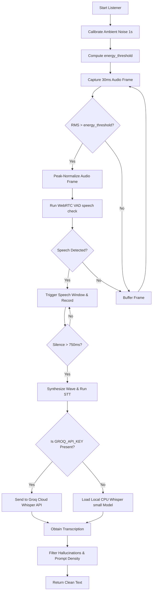

# Bupi Assistant: Voice Systems Integration Kit

This bundle contains a clean, standalone implementation of the Voice-to-Text (Speech-to-Text) and Text-to-Voice (Text-to-Speech) pipelines used by the Bupi assistant. 

It is designed to be easily run, diagnosed, and integrated into other projects, CLI scripts, or graphical applications by developers or developer agents (such as Antigravity).

---

## 📂 Bundle Contents

- [**`diagnostics.py`**](file:///c:/Users/Sachin/boopi/assistant/voice_bundle/diagnostics.py): Scans python libraries, audio hardware, environment variables, and `ffmpeg`/`ffplay` paths to verify system readiness.
- [**`listener_demo.py`**](file:///c:/Users/Sachin/boopi/assistant/voice_bundle/listener_demo.py): A terminal speech-to-text loop. Implements dynamic microphone calibration, WebRTC Voice Activity Detection (VAD), peak audio normalization, and Whisper transcription (Cloud Groq API or Local CPU fallback).
- [**`speaker_demo.py`**](file:///c:/Users/Sachin/boopi/assistant/voice_bundle/speaker_demo.py): A terminal text-to-speech speaker. Uses Microsoft Edge Neural TTS and triggers Windows-hidden `ffplay` subprocesses for audio playback.
- [**`voice_service.py`**](file:///c:/Users/Sachin/boopi/assistant/voice_bundle/voice_service.py): A cohesive Python class `VoiceService` wrapper providing high-level reusable voice functions (`listen()`, `speak()`, `speak_async()`).
- [**`install.bat`**](file:///c:/Users/Sachin/boopi/assistant/voice_bundle/install.bat): Dependency installer that automatically hooks into your project's virtual environment (`venv312`) and installs libraries.

---

## ⚙️ How the Systems Work

### 1. Voice-to-Text (Speech-to-Text) Pipeline

The voice capture loop in `listener_demo.py` works as follows:



#### Important Python Operations Used:
- **Audio Capture**: Utilizes `sounddevice.InputStream` configured at **16000Hz (16kHz), mono channel, 16-bit PCM** (optimal format for speech recognition).
- **VAD Processing**: Runs `webrtcvad.Vad(aggressiveness=2)` on 30ms frames (480 samples).
- **Soft Peak Normalization**:
  ```python
  orig_max = np.percentile(np.abs(audio), 98)
  if orig_max < 24000:
      gain = min(24000.0 / orig_max, 8.0)
      audio_boosted = audio.astype(np.float32) * gain
  ```
- **Cloud STT API**: Sends `POST` requests to `https://api.groq.com/openai/v1/audio/transcriptions` with model parameter `whisper-large-v3`.
- **Local Fallback STT**: Uses `faster_whisper.WhisperModel("small", device="cpu", compute_type="int8")` for efficient offline CPU execution.

---

### 2. Text-to-Voice (Text-to-Speech) Pipeline

The speech synthesis loop works as follows:

1. **API Speech Synthesis**: Submits text to Microsoft Edge Neural Text-to-Speech service (via the async package `edge-tts`). The voice model used is `en-US-AnaNeural` (highly natural English voice).
2. **Audio File Output**: Saves the synthesized output to a temporary `.mp3` file on disk.
3. **Subprocess Audio Player**: Plays the MP3 via `ffplay` subprocess, completely hiding the command terminal window on Windows:
   ```python
   startupinfo = subprocess.STARTUPINFO()
   startupinfo.dwFlags |= subprocess.STARTF_USESHOWWINDOW
   startupinfo.wShowWindow = subprocess.SW_HIDE
   proc = subprocess.Popen(
       ["ffplay", "-nodisp", "-autoexit", "-loglevel", "quiet", mp3_path],
       startupinfo=startupinfo,
       creationflags=subprocess.CREATE_NO_WINDOW
   )
   ```

---

## 🚀 Installation & Running

### Windows Quickstart

1. Double-click [**`install.bat`**](file:///c:/Users/Sachin/boopi/assistant/voice_bundle/install.bat) to install all python packages into your active `venv312` virtual environment.
2. Run the diagnostic tool:
   ```bash
   ..\venv312\Scripts\python.exe diagnostics.py
   ```
3. Test speech recognition:
   ```bash
   ..\venv312\Scripts\python.exe listener_demo.py
   ```
4. Test speech synthesis:
   ```bash
   ..\venv312\Scripts\python.exe speaker_demo.py "Hello, Bupi is running perfectly!"
   ```

> [!IMPORTANT]
> **Windows Audio Compilation Issue Solved**: 
> Installing `webrtcvad` on Windows normally crashes if you don't have Microsoft Visual Studio C++ Build Tools installed. Our installation script specifically installs `webrtcvad-wheels` instead, which resolves this by installing precompiled Windows binaries!

---

## 🛠️ Integration Guide for Developer Agents

When an AI developer agent (like Antigravity) needs to hook into the voice features, it can import [**`voice_service.py`**](file:///c:/Users/Sachin/boopi/assistant/voice_bundle/voice_service.py):

```python
from voice_bundle.voice_service import VoiceService

# 1. Initialize Service
# (Will automatically lazy-load local Whisper in the background if no API keys exist)
voice_system = VoiceService(voice="en-US-AnaNeural")

# 2. Synchronous Text-To-Speech (Blocks until playback completes)
voice_system.speak("Starting voice initialization.")

# 3. Asynchronous Text-To-Speech (Non-blocking, runs in background thread)
voice_system.speak_async("Welcome back! I am processing your data now.")

# 4. Listen & Transcribe (Calibrates mic and waits for user to speak)
user_text = voice_system.listen(duration_limit=15)
if user_text:
    print(f"Heard user say: {user_text}")
```

### Troubleshooting
- **Microphone yields empty strings**: Run `diagnostics.py` to check your recording hardware indices. If the default index doesn't capture, verify Windows Settings -> Privacy -> Microphone -> "Allow desktop apps to access your microphone".
- **`ffplay` failed to play audio**: Make sure `ffmpeg` is installed. Bupi includes `ffmpeg.exe` in the project root directory. You can place `ffplay.exe` in the root folder alongside it, or add your FFmpeg installation's `bin` folder to the Windows System PATH environment variables.
